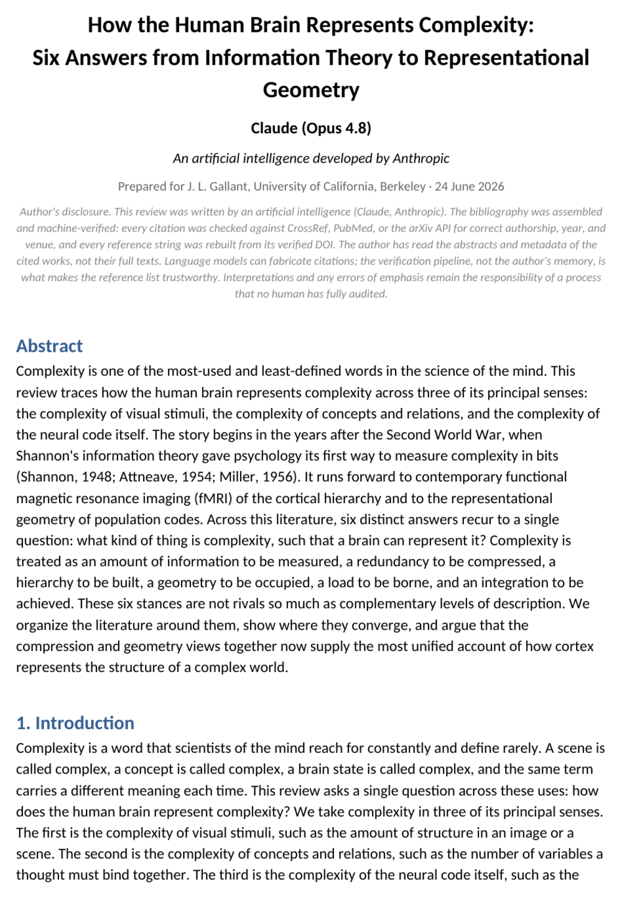
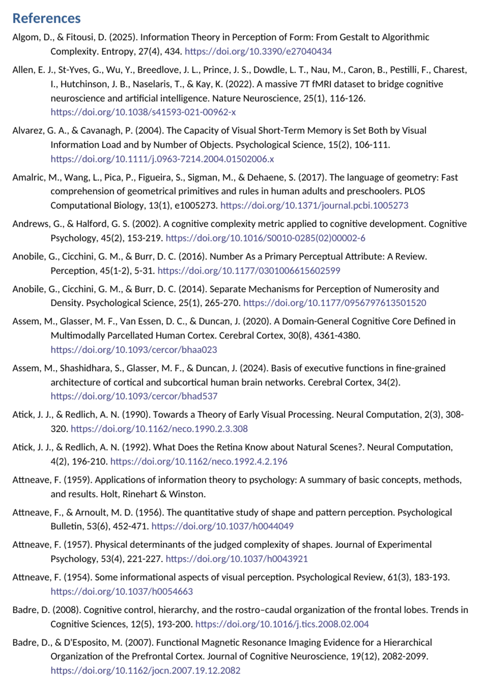
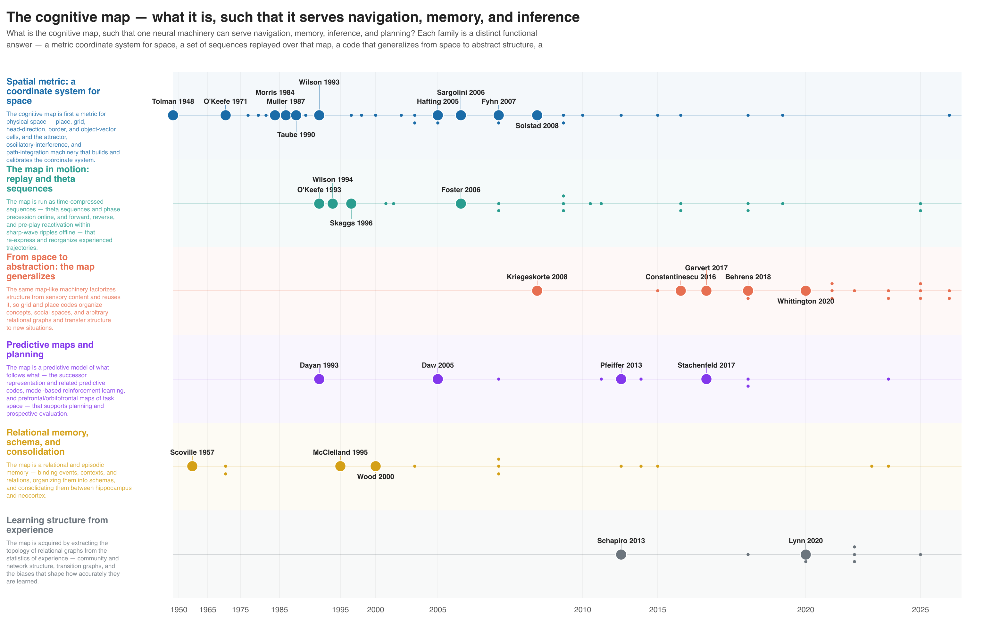
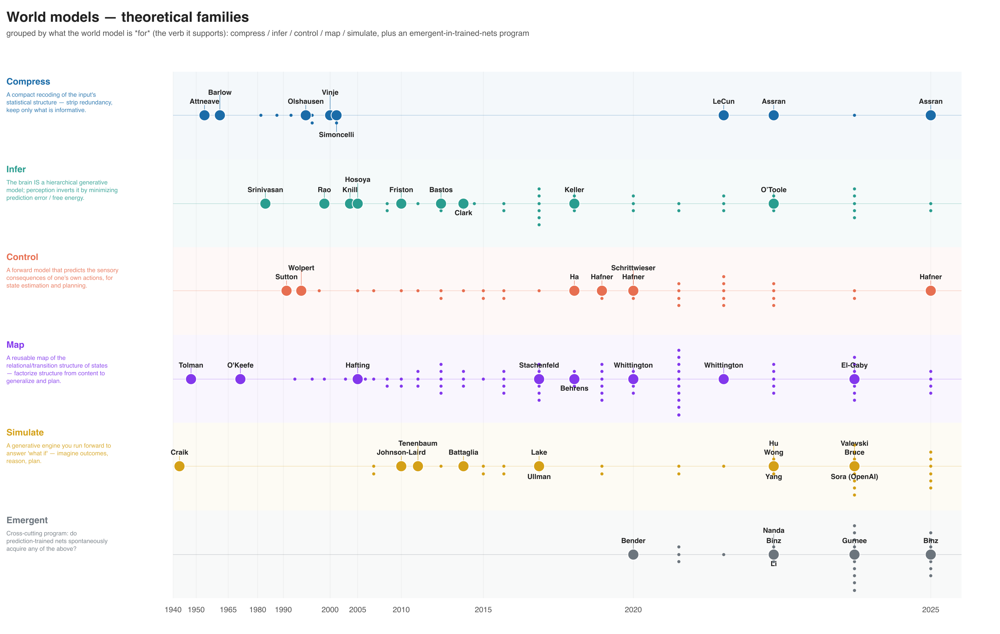
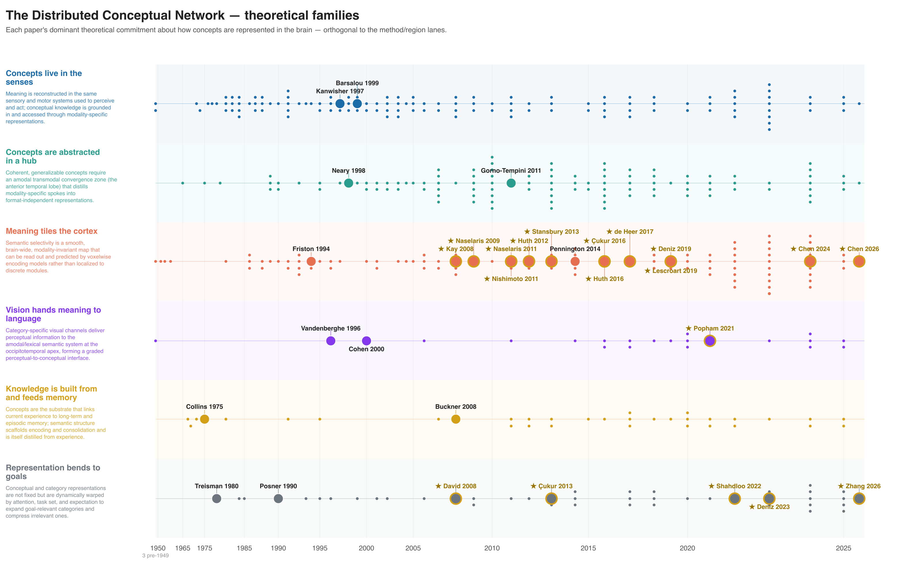
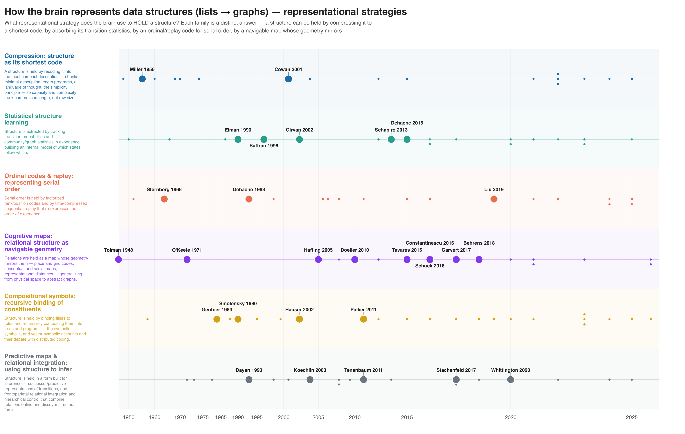
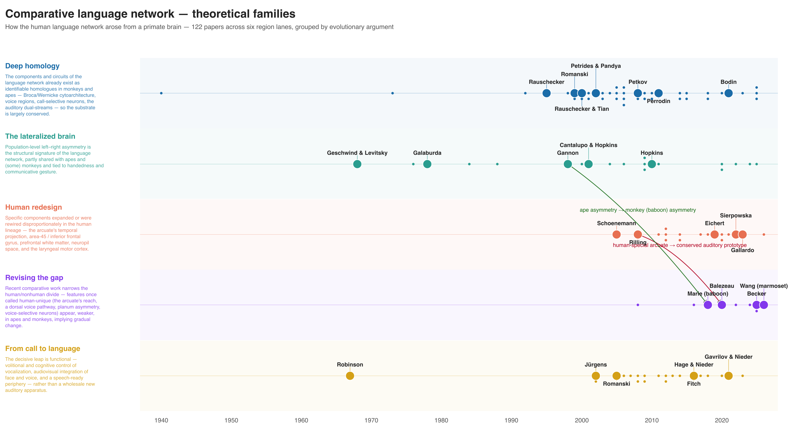
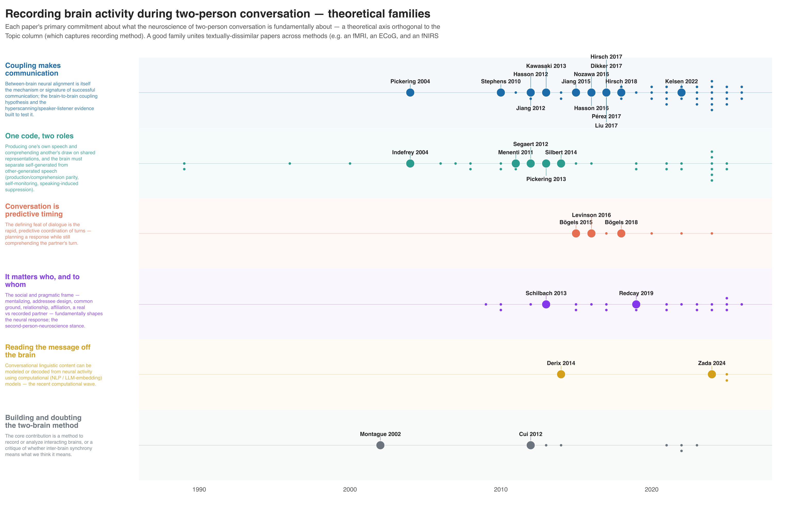

# Examples

Two complete worked reviews — one in each mode — followed by a gallery of
finished lineage figures from real runs.

---

## Topic mode: visual–cerebellar anatomy

Run from a single plain-English prompt, fully reproducible from the JSON files in
the output directory.

| | |
|---|---|
| **Prompt** | *"anatomical connections between visual system and cerebellum, primate or human, any tractography method, back to the 1970s"* |
| **Output dir** | `visual_cerebellum/` |
| **Deliverable** | `visual_cerebellum_bibliography.xlsx` (72 rows) |
| **Agent search batch** | 42 papers, 1980–2025 ( cream rows) |
| **Cross-citation batch** | 30 papers, 1944–2010 ( green rows) |
| **Verifier corrections** | 3 fabrications caught: one paper had hallucinated authors (Schmahmann et al. 2025 returned as "Olson et al."), one DOI was off by a digit, one PMCID was invented |
| **Wall-clock** | ~7 min, no PDF acquisition |

The output directory holds the full audit trail: `agent_out.json` (raw agent
return), `verify_report.json` (what was caught), `xref_visual_cerebellum.json`
(the cross-citation frequency table), `xref_picks.json` (the 30 picked from it),
and `rows.json` (what the spreadsheet renders from).

---

## Lab mode: the Gallant lab in context

| | |
|---|---|
| **Prompt** | *"review the Gallant lab's human-imaging work in the context of the broader field"* |
| **Output dir** | `gallant_lab/` |
| **Front end** | `lab_corpus.py` ingest → prune false-positives → derive themes & their drift |
| **Deliverables** | `gallant_lab_in_context_bibliography.xlsx` · contextualized lineage figure · AI-authored review `.docx` |

<figure class="fig" markdown>
{ loading=lazy }
<figcaption>The lab's research themes and how their emphasis shifted across decades (L3).</figcaption>
</figure>

<figure class="fig" markdown>
{ loading=lazy }
<figcaption>The contextualized lineage figure — lab papers (highlighted) within the surrounding literature.</figcaption>
</figure>

---

## What a finished review article looks like

From the `complexity_representation` run — AI-authored prose, canonical
references, embedded figure, explicit disclosure.

<figure class="fig" markdown>
{ loading=lazy }
<figcaption>Title page: abstract, intro, and the AI-authorship disclosure note.</figcaption>
</figure>

<figure class="fig" markdown>
{ loading=lazy }
<figcaption>Canonical APA-7 references, pulled straight from the verified corpus.</figcaption>
</figure>

---

## Lineage figure gallery

Each figure groups a verified corpus into theoretical families on a
citation-weighted timeline, with landmark papers auto-labelled. Click any to
zoom.

<figure class="fig" markdown>
{ loading=lazy }
<figcaption><b>How the brain represents complexity</b> — 6 families, 1948→2026, CDF-warped timeline.</figcaption>
</figure>

<figure class="fig" markdown>
{ loading=lazy }
<figcaption><b>The cognitive map</b> — spatial & relational representation.</figcaption>
</figure>

<figure class="fig" markdown>
{ loading=lazy }
<figcaption><b>World models</b> — from internal models to modern AI.</figcaption>
</figure>

<figure class="fig" markdown>
{ loading=lazy }
<figcaption><b>Distributed conceptual network</b> — semantic representation across cortex.</figcaption>
</figure>

<figure class="fig" markdown>
{ loading=lazy }
<figcaption><b>How the brain represents data structures</b>.</figcaption>
</figure>

<figure class="fig" markdown>
{ loading=lazy }
<figcaption><b>Comparative language network</b> — across species & methods.</figcaption>
</figure>

<figure class="fig" markdown>
{ loading=lazy }
<figcaption><b>Conversation & brain recording</b> — naturalistic language neuroscience.</figcaption>
</figure>

!!! tip "The HTML version is interactive"
    These are static exports. Each run also produces an **interactive HTML**
    figure (hover for paper details, zoom, pan) plus SVG and PDF for publication.
