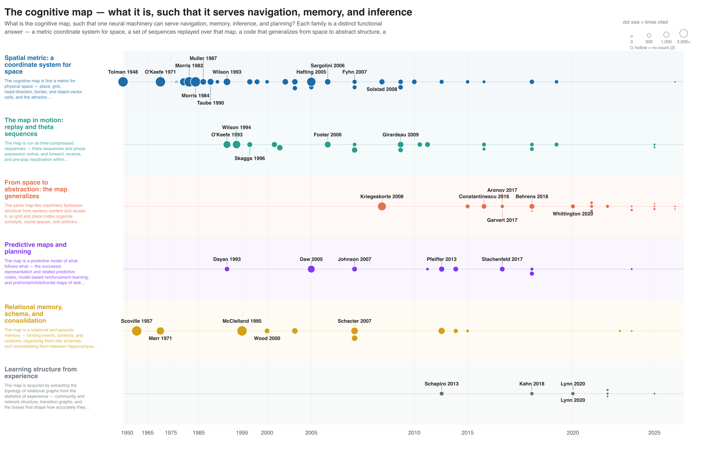
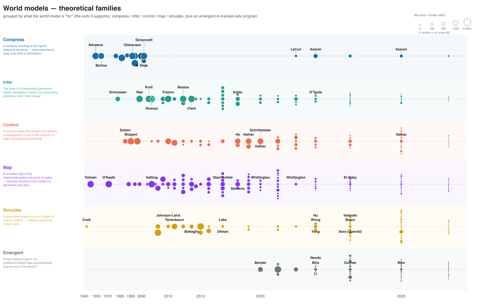
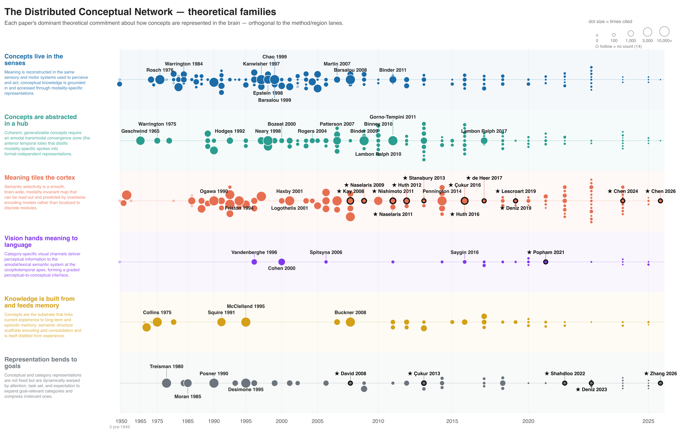
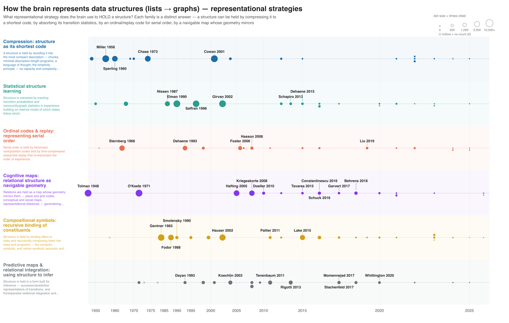
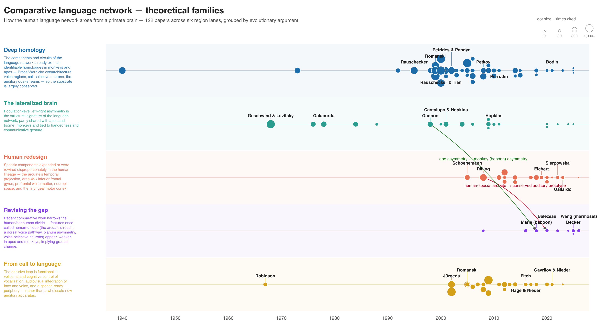
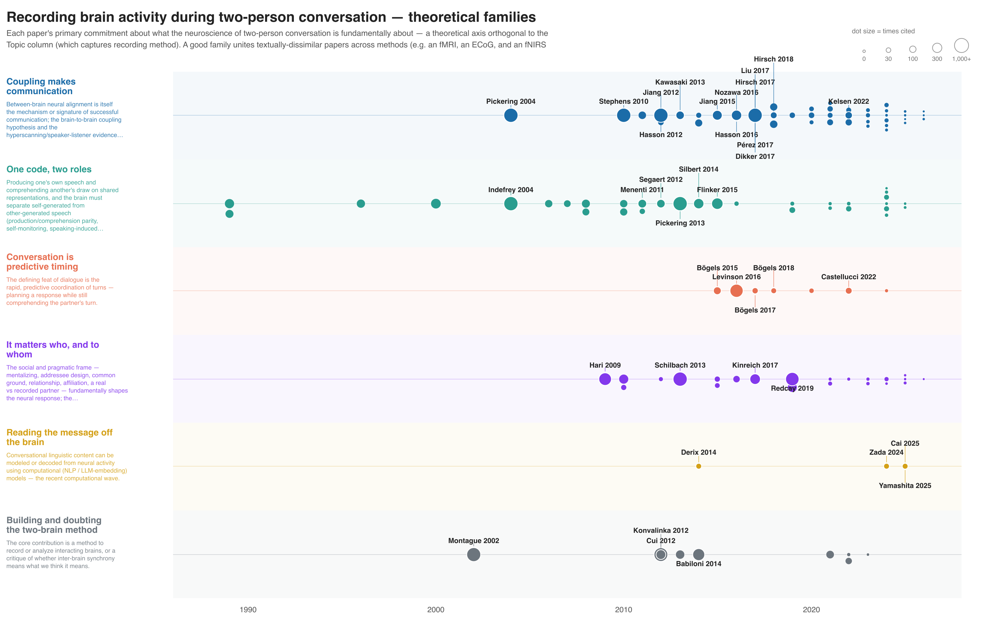

# Examples

Finished runs: one review in each mode, pages from a review article, and a
gallery of lineage figures. Every figure here is unedited toolkit output. Click
any figure to enlarge it.

**How to read a lineage figure.** Each horizontal lane is one theoretical family,
labeled at left with its claim. Each dot is one verified paper, placed by
publication year. Dot area is proportional to citation count, and a hollow dot
has no count. Labeled dots are landmarks, chosen automatically by citation count
and by how often the corpus itself cites them. A ring and a ★ mark a home-lab
paper. [§7.2 of the manual](manual.md#72-the-lineage-figure) gives the full key.

---

## Topic mode: visual–cerebellar anatomy

| | |
|---|---|
| **Prompt** | *"anatomical connections between visual system and cerebellum, primate or human, any tractography method, back to the 1970s"* |
| **Deliverable** | `visual_cerebellum_bibliography.xlsx`, 72 papers |
| **From the search** | 42 papers, 1980–2025 ( cream rows) |
| **From the cross-citation pass** | 30 papers, 1944–2010 ( green rows) |
| **Caught by verification** | 3 fabrications: a real 2025 paper by Schmahmann et al. returned as "Olson et al.", a DOI off by one digit, and an invented PMCID |
| **Time** | about 7 minutes, without PDFs |

The cross-citation pass found the field's older anatomy (1944–2010) that the
forward search missed. The output directory keeps the audit trail:
`agent_out.json` (raw search results), `verify_report.json` (what verification
caught), `xref_visual_cerebellum.json` (the cross-citation table),
`xref_picks.json` (the 30 papers taken from it), and `rows.json` (the table the
spreadsheet is built from).

---

## Lab mode: the Gallant lab in context

| | |
|---|---|
| **Prompt** | *"review the Gallant lab's human-imaging work in the context of the broader field"* |
| **Front end** | `lab_corpus.py` ingest → prune false positives → derive themes |
| **Deliverables** | `gallant_lab_in_context_bibliography.xlsx`, two lineage figures, an AI-authored review `.docx` |

<figure class="fig" markdown>
{ loading=lazy }
<figcaption markdown>
**Lab mode first maps the lab's own work.** The 61 human-imaging papers from the
Gallant lab, grouped into six research themes derived in phase L3. Every paper is
a lab paper, so every dot is ringed and starred. The lab's work moves from visual
encoding and stimulus reconstruction (2000–2015) to semantic maps of visual
cortex (from 2012) and then to language (from 2016). A methods-and-software lane
runs throughout. This map defines the themes that the next step places in the
wider field.
</figcaption>
</figure>

<figure class="fig" markdown>
{ loading=lazy }
<figcaption markdown>
**The same themes, placed in the field.** Phase L4c searched outward from each
theme, adding 287 papers from other groups to 72 lab papers (359 in total).
Ringed, starred dots are lab papers; plain dots are the field. In visual encoding
the lab's papers sit inside a dense literature that began decades earlier. In
language, most of the field's papers postdate the lab's 2016 landmark. The figure
shows which themes the lab entered as established literatures and which grew
after its work.
</figcaption>
</figure>

---

## A finished review article

Pages from the `complexity_representation` review `.docx` (Phase 7).

<figure class="fig" markdown>
{ loading=lazy }
<figcaption markdown>
**The title page states who wrote the review and how it was checked.** Below the
title, the author block names the AI model. The author's disclosure explains that
every citation was machine-verified and every reference rebuilt from its DOI, and
that the author read abstracts, not full texts. The abstract and introduction
follow.
</figcaption>
</figure>

<figure class="fig" markdown>
{ loading=lazy }
<figcaption markdown>
**The reference list is generated from the verified corpus, not typed.** Each
entry has its full author list, a sentence-case title and a DOI link. Entries
follow APA-7 order: one author's works by year, and a sole author before that
author's co-authored papers (Attneave, 1959, then Attneave & Arnoult, 1956). The
one entry without a link is a DOI-less book, which keeps a hand-written
reference.
</figcaption>
</figure>

---

## Lineage figure gallery

<figure class="fig" markdown>
{ loading=lazy }
<figcaption markdown>
**How the brain represents complexity (190 papers).** Six families, each a
different answer to what complexity is: information, redundancy to compress,
hierarchy, representational geometry, bounded capacity, or integrated
information. The information, redundancy and capacity lanes rest on 1950s
landmarks (Shannon, Attneave, Miller). Hierarchy follows in the 1960s,
integration in the 1990s, and geometry in the mid-2000s. The six answers accumulated
over seven decades; none replaced the others.
</figcaption>
</figure>

<figure class="fig" markdown>
{ loading=lazy }
<figcaption markdown>
**The cognitive map (110 papers).** Six families, each a different account of
what the map is for: a spatial metric, replayed sequences, abstract structure,
prediction and planning, relational memory, or structure learned from
experience. The spatial and memory lanes start with Tolman (1948), Scoville
(1957) and O'Keefe (1971). The abstraction lane starts in 2008. Extending the
map beyond physical space is a recent idea.
</figcaption>
</figure>

<figure class="fig" markdown>
{ loading=lazy }
<figcaption markdown>
**World models (348 papers).** Families are named for what the model does:
compress, infer, control, map, simulate, or emerge in trained networks. The
compression lane is almost entirely pre-2005 (Attneave, Barlow, Olshausen). The
simulation and emergence lanes are densest in 2023–2025. The field's recent growth
is concentrated in its two newest families.
</figcaption>
</figure>

<figure class="fig" markdown>
{ loading=lazy }
<figcaption markdown>
**The distributed conceptual network (450 papers).** Six accounts of how
concepts are stored: in sensory and motor systems, in an amodal hub, as a map
tiling cortex, handed from vision to language, built from memory, or bent by
goals. The sensory and hub accounts have run in parallel since the 1970s. Most
home-lab papers (★) fall in the "meaning tiles the cortex" lane, from 2008 on.
</figcaption>
</figure>

<figure class="fig" markdown>
{ loading=lazy }
<figcaption markdown>
**How the brain represents data structures (117 papers).** Six strategies for
holding a structure: compression, statistical learning, ordinal codes, cognitive
maps, compositional symbols, or predictive maps. Each strategy has its own roots
between 1948 and 1990 (Tolman, Miller, Sternberg, Smolensky). The cognitive-map
lane grows fastest after 2005. Most of today's accounts of structure descend from
ideas older than neuroimaging.
</figcaption>
</figure>

<figure class="fig" markdown>
{ loading=lazy }
<figcaption markdown>
**The comparative language network (122 papers).** Five evolutionary arguments
for how human language arose from a primate brain. The axis is linear
(no time warp). The two arrows are editorial (`--spec`). Each links an older claim
that a feature is unique to humans or apes to a recent paper that found it in
monkeys. Every "revising the gap"
paper dates from 2008 or later, so the case for gradual evolution is recent.
</figcaption>
</figure>

<figure class="fig" markdown>
{ loading=lazy }
<figcaption markdown>
**Recording brain activity during conversation (131 papers).** Six views of what
the neuroscience of dialogue is about: brain-to-brain coupling, shared
production and comprehension codes, turn timing, social context, decoding the
message, and the two-brain method itself. Nearly all of it postdates 2004. The
decoding lane holds only four papers, three from 2024–2025, so computational
decoding of conversation has barely begun.
</figcaption>
</figure>

!!! tip "The HTML version is interactive"
    Each run also produces an interactive HTML figure. Hover a dot for its
    reference, click it for its summary, counts and DOI, and step through papers
    with Next/Prev or the arrow keys. SVG and PDF exports are produced for
    publication. See [Reading the lineage figure](manual.md#72-the-lineage-figure).
