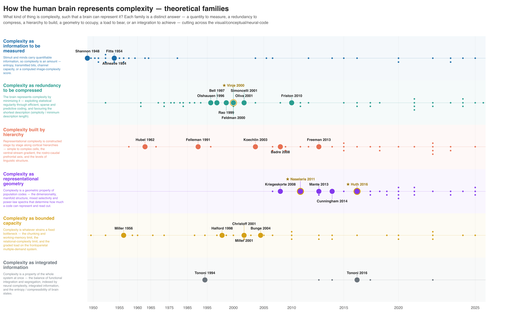

# literature-review-toolkit

**Scaffolding to drive a Claude (or other LLM) agent through a structured
literature review — and keep it honest.**

The agent does the judgment work: choosing what to search, what matters, how to
group it, and (optionally) how to write it up. These scripts handle the API
calls, the verification, and the bookkeeping — the parts an LLM is *worst* at and
where a single fabricated author or off-by-one DOI quietly poisons a review.

<figure class="fig" markdown>
{ loading=lazy }
<figcaption>
A finished lineage figure (Phase&nbsp;6b) — 190 verified papers grouped into six
theoretical families, plotted on a citation-weighted timeline from Shannon&nbsp;1948
to today. Landmark papers are auto-labelled. Every dot is a verified, canonically
formatted reference in the spreadsheet.
</figcaption>
</figure>

## The core idea: judgment vs. mechanics

A literature review has a few points where a **human** genuinely has to decide
something. Everything between those points has a *ground truth* — a DOI either
resolves to the paper you cited or it doesn't — so it should be **mechanized and
guarded, not left to the agent's memory.**

1
### Scope
You decide the topic and the span of the search (Phase&nbsp;1) — or, in **lab
mode**, you point it at a lab's publication corpus.

2
### Families *(optional)*
You approve or edit the agent's proposed theoretical grouping **before** it
labels every paper (Phase&nbsp;6b).

3
### The write-up *(optional)*
If you want a narrative review, the agent authors the prose — the one judgment
step the toolkit does **not** mechanize (Phase&nbsp;7).

In between, the mechanical steps run automatically but are **guarded**:

- A required **antecedents pass** searches the topic's methodological,
  empirical, and theoretical roots — the forward search is recency-biased and
  misses them.
- **Every citation is verified** against PubMed / PMC / CrossRef / arXiv. Search
  agents fabricate roughly **1 in 4** — wrong first authors, inverted findings,
  invented or mis-copied DOIs, even an entirely wrong author list for a real
  paper.
- **Every reference is rebuilt** from its verified DOI into canonical APA-7,
  behind a hard audit gate. No agent-typed or database-typed reference text is
  trusted.
- **Citation counts** are fetched, reconciled against a second database, and
  schema-checked; cross-citation mining and dedup run; the spreadsheet is
  rebuilt from JSON each time.

!!! quote "The principle"
    The agent supplies judgment; the scripts supply ground truth. Wherever a
    fact can be checked, it is checked — automatically, every time, with a gate
    that fails the build rather than your reader.

## What you get out

The **core deliverable is one `.xlsx` file** — an annotated, verified, fully
formatted bibliography. Two optional deliverables sit on top of it, both rendered
from the same verified data:

### :material-table: Spreadsheet
The always-on deliverable. One row per paper: canonical APA-7 reference, summary,
tag, family, and citation counts — colour-coded by where the paper came from.

### :material-chart-timeline-variant: Lineage figure *(opt)*
An interactive HTML figure (plus SVG/PNG/PDF) grouping the corpus into
theoretical families on a citation-weighted timeline.

### :material-file-document-edit: Review article *(opt)*
An AI-authored narrative review `.docx` — prose by the agent, references pulled
canonically from the verified corpus, with a mandatory priority audit.

## Two ways in

=== "Topic mode"

    Start from a question and search outward.

    > *"Literature review on the anatomical connections between the visual system
    > and the cerebellum — primate or human, any tractography method, back to the
    > 1970s."*

=== "Lab mode"

    Start from a lab's full publication corpus, derive its research themes and how
    they shifted over time, then search outward to place that work in the field.

    > *"Review the Gallant lab's human-imaging work in the context of the broader
    > field."*

Both share the same verify → canonicalize → count → families → figure → review
machinery. See [Topic mode vs lab mode](modes.md).

## Next steps

- **[Getting started](getting-started.md)** — install, configure, and run your
  first review.
- **[The pipeline](pipeline.md)** — the whole flow on one page.
- **[Phases in detail](phases.md)** — every phase, its guardrail, and its real
  output shown as a figure.
- **[Examples](examples.md)** — two complete worked reviews, plus a gallery of
  finished lineage figures.

!!! note "AI disclosure"
    This toolkit is designed to be driven by an LLM agent, and the optional review
    articles it produces are AI-authored (with an explicit disclosure note in every
    document). The verification machinery exists precisely because LLM output cannot
    be trusted on matters of fact without checking.
