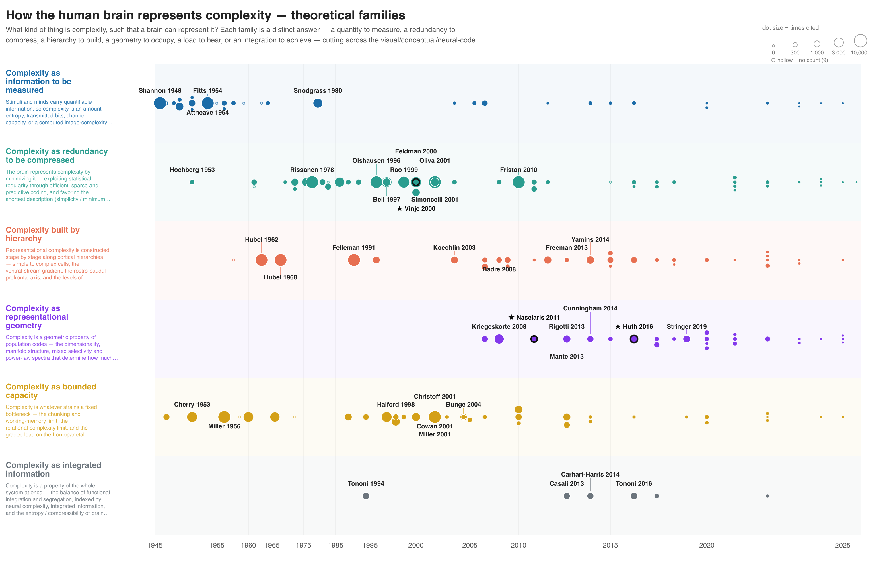

# literature-review-toolkit

**Scripts that let an LLM agent run a literature review without fabricating
references.**

Version 1.25.0 · MIT license · [AI disclosure](#ai-disclosure)

The agent decides what to search, what matters, how to group it, and optionally
how to write it up. The scripts handle the API calls, verification and
bookkeeping. That is the work LLMs do worst, and one invented author or wrong DOI
can quietly corrupt a review.

<div class="hero" markdown>

<figure class="fig" markdown>
{ loading=lazy }
<figcaption markdown>
**A finished lineage figure.** 190 verified papers on how the brain represents
complexity, grouped into six theoretical families on a timeline from 1948 to
2026. Dot area shows citation count, and the labeled dots are landmarks the
toolkit chose automatically. Every dot is a verified, canonically formatted
reference in the accompanying spreadsheet.
</figcaption>
</figure>

</div>

## Judgment versus ground truth

A review needs human judgment at only three points. Everything between them has
a ground truth: a DOI either resolves to the cited paper or it does not. So the
toolkit checks those steps by script instead of trusting the agent's memory.

<div class="cards" markdown>

<div class="card" markdown>
<span class="big">1</span>
### Scope
You choose the topic and how far back to search, or, in **lab mode**, which
lab's publications to start from.
</div>

<div class="card" markdown>
<span class="big">2</span>
### Families and the timeline
The agent always offers the timeline and proposes the families it would use. You
use them, change them, or skip the timeline.
</div>

<div class="card" markdown>
<span class="big">3</span>
### The write-up *(optional)*
The agent writes the narrative review. This is the one judgment step the toolkit
does not mechanize.
</div>

</div>

Between those points, every step runs automatically:

- **Antecedents.** A required second search finds the field's methodological,
  empirical and theoretical roots, which a forward search misses.
- **Verification.** Every citation is checked against PubMed, PMC, CrossRef,
  DataCite and arXiv. Search agents fabricate roughly **1 in 4**.
- **Canonical references.** Every reference is rebuilt from its verified DOI into
  APA-7. References with no DOI get a hand check.
- **Summary checks.** A checking agent with no web access compares every
  summary with the paper's abstract.
- **Citation counts.** Counts come from OpenAlex, checked against Semantic
  Scholar.
- **The audit.** A failed check stops the build. The spreadsheet runs the full
  audit and refuses a table that fails it.

## What you get

<div class="cards" markdown>

<div class="card" markdown>
### :material-table: Spreadsheet
The core deliverable. One row per paper: canonical reference, summary, tag,
family and citation counts, colored by where the paper came from.
</div>

<div class="card" markdown>
### :material-chart-timeline-variant: Lineage timeline
Offered on every review. An interactive HTML figure that lays out the families
on a timeline, with an SVG copy, plus PNG and PDF when `rsvg-convert` or
Inkscape is installed. It is often the most useful thing a review produces.
</div>

<div class="card" markdown>
### :material-file-document-edit: Review article *(optional)*
An AI-authored narrative review (`.docx` and a web page), with its references
drawn from the verified corpus.
</div>

</div>

## Two modes

=== "Topic mode"

    Start from a question and search outward.

    > *"Literature review on the anatomical connections between the visual system
    > and the cerebellum — primate or human, any tractography method, back to the
    > 1970s."*

=== "Lab mode"

    Start from a lab's publications, derive its research themes, then search
    outward to place that work in the field.

    > *"Review the Gallant lab's human-imaging work in the context of the broader
    > field."*

From verification on, both modes run the same pipeline. See
[Choosing a front end](manual.md#4-choosing-a-front-end).

## Get started

You need Python 3, a contact email, and two free API keys. Without an OpenAlex
key, every client on one IP address shares a single daily budget, and a campus
network can spend it before you start. Keyless Semantic Scholar is heavily
throttled.

```bash
git clone https://github.com/gallantlab/literature-review-toolkit.git
cd literature-review-toolkit
pip install -r requirements.txt
export LITREVIEW_EMAIL=you@institution.edu   # NCBI and CrossRef require one
export OPENALEX_API_KEY=...                   # https://help.openalex.org/api/authentication
export S2_API_KEY=...                         # https://www.semanticscholar.org/product/api#api-key-form
python3 tools/preflight.py --project <topic>/ --papers 600   # newer version? keys? today's OpenAlex budget?
```

Then open Claude Code in the directory that holds the clone and describe the
review. The agent runs the preflight first and follows
[`PLAYBOOK.md`](https://github.com/gallantlab/literature-review-toolkit/blob/main/PLAYBOOK.md).
A full build takes hours. [Installation](manual.md#21-install) and
[environment variables](manual.md#22-environment-variables) are covered in the
manual.

## Next steps

- **[Operator manual](manual.md)**: install, rules, every phase with its command
  and gate, how to read the outputs, and troubleshooting.
- **[Examples](examples.md)**: a finished review in each mode and a gallery of
  lineage figures.

## AI disclosure

**The toolkit was built with AI.** Most of its code and documentation were
written by Claude, Anthropic's AI model, under the direction of Jack Gallant
(Gallant Lab, UC Berkeley).

**What it produces is AI-generated too.** An LLM agent runs the searches,
writes each paper's summary from its abstract (not the full text), proposes the
family groupings, and writes the review articles. Every review article states
its AI authorship.

**Only facts are machine-checked.** The scripts verify every citation against
the literature databases and rebuild every reference from its DOI. Summaries,
groupings and interpretation cannot be checked that way; read them as an AI's
reading of the abstracts.
