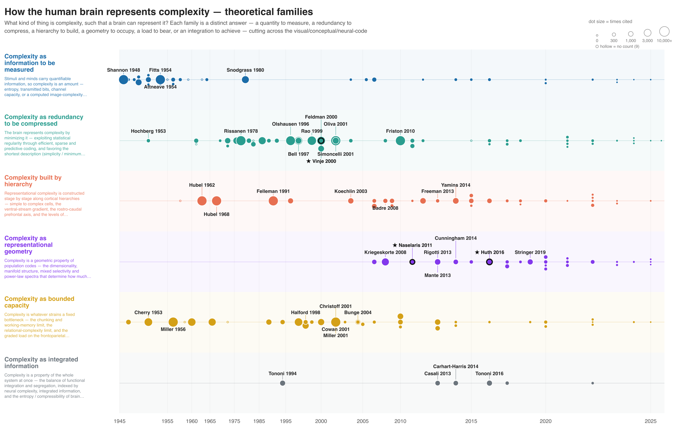

# literature-review-toolkit

**Ask an AI agent for a literature review, and get one with no invented
references.**

Version 2.4.2 · MIT license · [AI disclosure](#ai-disclosure)

You describe the review you want in plain English. An AI agent searches the
literature, groups the papers, and can write the review up. Scripts check every
reference against the publishers' databases, because an agent working from
memory gets about 1 in 4 citations wrong.

<figure class="fig" markdown>
{ loading=lazy }
<figcaption markdown>
**A finished timeline.** 190 checked papers on how the brain represents
complexity, in six families of ideas from 1948 to 2026. Larger dots are more
cited papers. Every dot is a row in the review's spreadsheet.
</figcaption>
</figure>

## Where to start

### :material-school: I want a literature review
Start with the **[Tutorial](tutorial.md)**: install, describe your review, and
read the results. Then see **[Example requests](requests.md)** and
**[Example results](examples.md)**.

### :material-code-braces: I want to change or extend the toolkit
Start with **[How it works](pipeline.md)**: the procedure the agent follows,
every script, and every check. Then see the
**[Tools reference](tools.md)** and **[Maintaining the docs](maintaining.md)**.

## What you get

### :material-table: A spreadsheet
One row per paper: the full reference, a link, a one-sentence summary, the
paper's family and its citation counts.

### :material-chart-timeline-variant: A timeline
An interactive page that lays the papers out by family and year. Click any paper
to read its summary.

### :material-file-document-edit: A written review *(optional)*
A narrative review drafted by the agent, citing only the checked papers.

## What you decide

The agent does the searching and checking. You make three decisions, and it asks
you for each one:

1. **The scope.** What the review covers, how far back it goes, and how big it
   is.
2. **The families.** The agent proposes how to group the papers. You accept the
   groups, change them, or skip the timeline.
3. **The write-up.** Whether you want a written review.

Everything else has a right answer that a script can check: a DOI either points
to the cited paper or it does not. So scripts check it, and a failed check stops
the review until it is fixed.

## AI disclosure

**The toolkit was built with AI.** Most of its code and documentation were
written by Claude, Anthropic's AI model, under the direction of Jack Gallant
(Gallant Lab, UC Berkeley).

**What it produces is AI-generated too.** An AI agent runs the searches, writes
each paper's summary from its abstract (not the full text), proposes the
families, and writes the reviews. Every written review states its AI authorship.

**Only facts are checked by machine.** The scripts check every citation against
the literature databases and rebuild every reference from its DOI. Summaries,
groupings and interpretation cannot be checked that way. Read them as an AI's
reading of the abstracts.
