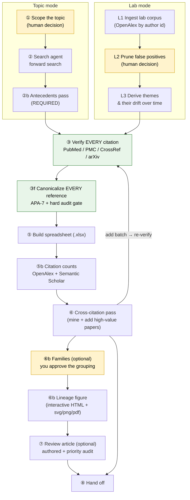
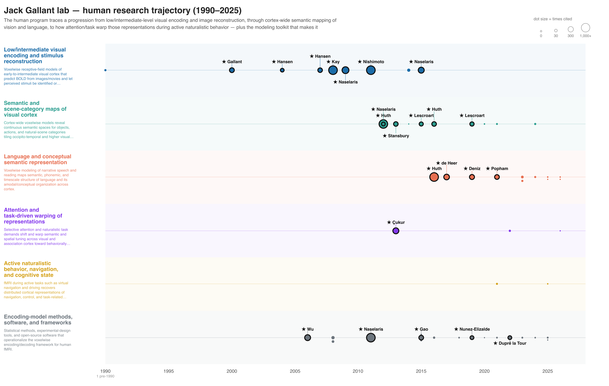
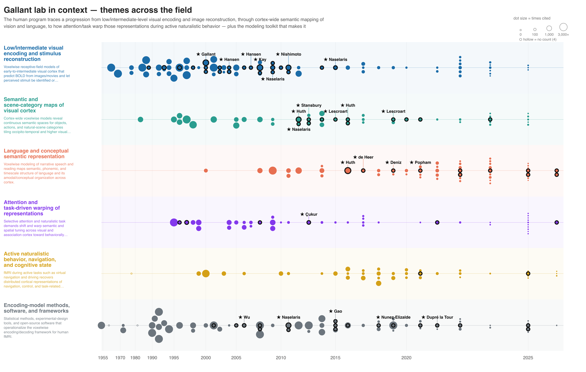
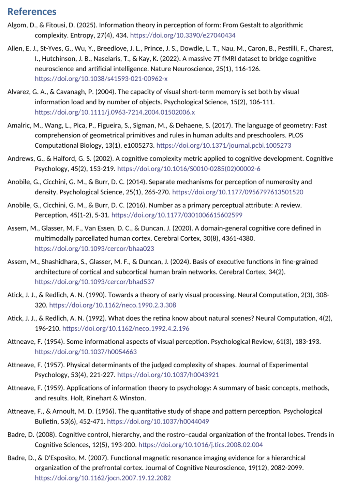

# Operator manual

The complete end-to-end document for running a review: setup, the rules that
don't bend, every phase with its command and its gate, how to read what comes
out, and what to do when a step fails.

!!! info "This is the one page to work from"
    Install, every phase with its command and its gate, how to read the outputs,
    and what to do when a step fails. [Examples](examples.md) shows finished runs;
    the [Tools reference](tools.md) carries the per-script index. The authoritative
    procedure the agent itself follows is
    [`PLAYBOOK.md`](https://github.com/gallantlab/literature-review-toolkit/blob/main/PLAYBOOK.md).

---

## 1. What the toolkit is for

A literature review has a handful of points where a person genuinely has to
decide something, and a great deal of work in between that has a **ground
truth** — a DOI either resolves to the paper you cited or it does not.

The toolkit's whole premise is to split those apart. **The agent supplies
judgment; the scripts supply ground truth.** Wherever a fact can be checked it is
checked automatically, every time, behind a gate that fails the build rather than
your reader.

This matters because of one number: search agents fabricate roughly **1 in 4**
citations — wrong first authors, invented or mis-copied DOIs, inverted findings,
and occasionally an entirely wrong author list for a paper that genuinely exists.
Nothing downstream is allowed to trust an unverified reference.

**Target size.** Aim for ~50–70 high-impact and recent papers per topic,
classified and summarized. Large corpora (400–650 papers) work, but several
defaults are tuned for the smaller case and need retuning — see
[§9.4](#94-the-figure-hides-landmarks-or-looks-wrong).

### 1.1 The pipeline at a glance

Two front ends converge on a shared verify → canonicalize → count →
cross-reference → (group → figure → write) backbone.



<small>Yellow = a human decision. Green = a guarded, ground-truth step that runs
automatically but fails the build if something is wrong.</small>

**1** scope · **2** search · **2b** antecedents *(required)* · **3** verify
*(critical)* · **3f** canonicalize · **4** PDFs *(opt-in)* · **5** spreadsheet ·
**5b** citation counts · **6** cross-citation · **6b** families *(opt)* · **7**
review article *(opt)* · **8** hand-off.

### 1.2 The three decisions that are yours

Everything else is mechanized. You only *decide* three things, and the last two
are optional:

| # | You decide… | Phase | Why it's yours |
|---|---|---|---|
| 1 | **Scope** — topic and span (or which lab corpus) | 1 / L1–L2 | Only you know the question. |
| 2 | **Families** *(optional)* | 6b | You approve the grouping *before* it labels every paper. |
| 3 | **The write-up** *(optional)* | 7 | Prose is judgment; the toolkit won't fake it. |

---

## 2. Before you start

### 2.1 Install

```bash
git clone https://github.com/gallantlab/literature-review-toolkit.git
cd literature-review-toolkit
pip install -r requirements.txt

# Only for the opt-in PDF reconciliation in Phase 4:
brew install poppler          # macOS
# or: sudo apt-get install poppler-utils
```

The tools are plain standalone Python 3 scripts with a tiny dependency footprint
(`xlsxwriter` for the spreadsheet, `python-docx` for the review). They are meant
to be **read and adapted** — scaffolding, not a framework. Run any with `--help`.

### 2.2 Identify yourself to the APIs

NCBI and CrossRef ask callers to supply a contact email; it buys politeness
limits instead of throttling.

```bash
export LITREVIEW_EMAIL=you@institution.edu
```

…or pass `--email you@institution.edu` to each invocation.

??? tip "Optional: `S2_API_KEY` for Semantic Scholar"
    Citation counts (Phase 5b) query OpenAlex first and Semantic Scholar as a
    cross-check. S2's free endpoints rate-limit (HTTP 429) anonymous callers on
    large corpora, and sometimes 400 on a batch where one malformed id poisons
    the whole request. With a key, export it:

    ```bash
    export S2_API_KEY=your-key-here
    ```

    Without one, accept partial S2 coverage — OpenAlex stands alone, but you lose
    the cross-check that catches its undercounts.

??? tip "Optional: `LITREVIEW_LAB_AUTHOR` for home-lab starring"
    Landmark selection can star your own group's papers. It is **off by default**
    so the toolkit is neutral for anyone who clones it. Opt in per project with
    `--lab-author Surname` (repeatable), or once for your shell:

    ```bash
    export LITREVIEW_LAB_AUTHOR=Gallant,Huth
    ```

    The flag overrides the env var. Rows with `source == "lab"` are always starred
    regardless. `--lab-color '#c1121f'` sets the ring and its label to your own
    color instead of the default gold — **quote it**, or the shell eats the `#`
    as a comment.

### 2.3 Where things live

Each review is **its own subdirectory** under a bibliography root, with the
toolkit cloned once beside them. The JSON files are the source of truth; the
`.xlsx` is rendered from them.

```text
<bibliography_root>/
├── literature-review-toolkit/              <- this repo, cloned once
├── visual_cerebellum/                      <- one review, one subdir
│   ├── visual_cerebellum_bibliography.xlsx     <-- THE DELIVERABLE
│   ├── topic_definition.md                 (scope you and the agent agreed on)
│   ├── rows.json                           (the LIVE table — all renders come from it)
│   ├── verify_report.json                  (Phase 3 verdicts)
│   ├── citation_counts.json                (Phase 5b, cached)
│   ├── xref_visual_cerebellum.json         (Phase 6 frequency table)
│   ├── internal_citations.json             (Phase 6, within-corpus in-degree)
│   ├── families.json / families.md         (Phase 6b, if run)
│   ├── figure_render_args.txt              (Phase 6b: the exact args used)
│   ├── visual_cerebellum_families.html     (Phase 6b figure; + svg/png/pdf)
│   ├── content.json                        (Phase 7 prose, if run)
│   └── Visual_Cerebellum_review.docx       (Phase 7, if run)
└── attention/                              <- a different topic, separate subdir
```

### 2.4 How you'll drive it

=== "With an agent (intended)"

    Open Claude Code in the bibliography root and describe the review in plain
    English. The agent reads `PLAYBOOK.md`, picks a slug, creates the
    subdirectory, runs the phases, and reports when done.

    ```text
    i want a literature review on the anatomical connections between the visual
    system and the cerebellum. any anatomy papers from primate or human, using
    any tractography method. go back as far as the 1970s.

    extend the existing visual_cerebellum review with another 20 papers focused
    on cerebello-thalamic projections.

    now group the world_models bibliography into a few theoretical families,
    and let's iterate on a lineage figure.
    ```

    It confirms scope only when something is genuinely ambiguous.

=== "By hand"

    Every phase is one script. You supply the search results as `rows.json`; the
    toolkit does the verification and bookkeeping. The commands are in
    [§5](#5-the-shared-backbone) below, in order.

---

## 3. The operating contract

Eight rules. Everything else in this manual elaborates them; when in doubt, obey
this list.

| # | Rule | Phase |
|---|---|---|
| 1 | **Verify EVERY citation** before it enters a deliverable. No exceptions, preprints included. | 3 |
| 2 | **Every reference is canonical** — rebuilt from its verified DOI. Never ship an agent-typed or database-typed string. `--audit` is a hard gate. | 3f |
| 3 | **One row per DOI.** Global dedup; a paper appears once in `rows.json`. | all |
| 4 | **Run the antecedents pass on every review**, both modes. Without it the field looks ten years old. | 2b |
| 5 | **Audit the temporal order of ideas** before delivering any written review. Origin claims cite the *earliest* deserving paper. | 7 |
| 6 | **`rows.json` is the live table after Phase 3f.** Edit it by hand; never re-run the row-emitter. | — |
| 7 | **Don't ask before fetching** from PubMed/PMC/CrossRef/OpenAlex/Unpaywall/arXiv/publishers — read-only academic GETs. Every link is a bare `https://doi.org/<doi>`, never a libproxy URL. | — |
| 8 | **PDFs are opt-in.** Default no. | 4 |

!!! danger "Rule 6 is the one that bites hardest"
    After canonicalization, re-running whatever emitted `rows.json` is
    **destructive** — it wipes the canonical `apa` strings and the citation
    counts. Canon and repair stamp each row with `canonical_at`, and
    `common.write_rows` refuses to overwrite a canonical table, but a project
    script that writes the file directly can still do the damage. Edit
    `rows.json` in place for any later change.

**Default tier criteria.** Pre-2021: only highly cited or foundational work.
2022+: promiscuous, no citation-count gate — too recent to have accrued cites.
The boundary is "today minus ~5 years"; advance it as the calendar moves.

---

## 4. Choosing a front end

One tool, two front ends. They differ only in where the corpus comes from; from
verification onward they are identical.

| | **Topic mode** | **Lab mode** |
|---|---|---|
| Start from | a question | a lab's publication corpus |
| Direction | search *outward* | derive themes *inward*, then place them in the field |
| Front-end phases | 1 scope → 2 search → 2b antecedents | L1 ingest → L2 prune → L3 themes → L4c contextualize |
| Answers | "What's known about X?" | "What has this lab done, and where does it sit?" |

### 4.1 Topic mode front end

**Phase 1 — scope (your decision).** Agree the question and its span: field,
species or method restrictions, how far back. Write it to `topic_definition.md`
so later phases and the antecedents search stay anchored to it.

**Phase 2 — search.** Run a search pass using
[`tools/search_prompt_template.md`](https://github.com/gallantlab/literature-review-toolkit/blob/main/tools/search_prompt_template.md),
returning papers as `rows.json`. **Links must be DOI URLs.**

!!! tip "Give each search lane an explicit verification duty"
    A lane brief that spells out the duty — read the author list off the landing
    page, confirm the DOI resolves to the *right* paper, read the abstract before
    summarizing — drops fabrication from the usual ~25% to near zero. On a
    555-paper corpus built this way, Phase 3 returned **535 OK, 2 MISMATCH, 0
    NOT-FOUND, and zero fabrications.** It is the single highest-leverage thing
    you can put in a search prompt.

!!! warning "Expect a third of your seed titles not to exist"
    If you seed lanes with remembered landmark titles, label them explicitly as
    *unverified suggestions*. Roughly 30–40% of memory-recalled titles are not
    real papers; agents told the seeds may be wrong substitute genuine work, and
    agents told otherwise invent something to match.

**Phase 2b — antecedents (required).** The forward search is recency-biased and
anchored on the topic's *current* framing, so it misses the roots. A separate
pass reaches back along three axes:

1. **Measurement / methodology origins** — where the tools came from.
2. **Foundational empirical results** — older neurophysiology, psychophysics.
3. **Theory / computational framework** — the ideas the field is built on.

Reuse the search template with the tier flipped to favor classics, then fold the
results into the existing themes (no new lanes unless you ask). Pre-2000
classics, books and chapters often have **no DOI** — keep them as hand-written
canonical APA and exclude them from citation counting.

### 4.2 Lab mode front end

```bash
python3 ../tools/lab_corpus.py --search "Jack Gallant"           # find the OpenAlex id
python3 ../tools/lab_corpus.py --author A5056348548 --out lab_papers.json
```

**L1 — ingest.** Pulls a PI's works from OpenAlex; pass several `--author` ids
for PI plus key members to widen coverage.

**L2 — prune (your decision).** Author disambiguation is the **#1 correctness
risk** in lab mode and cuts both ways: OpenAlex folds in same-name authors, and
also splits one person across several ids. Review the ingested list and drop the
false positives before anything is themed.

**L3 — derive themes.** The agent derives the lab's research themes and how
emphasis shifted over time. OpenAlex's topic metadata alone is not enough —
enrich abstracts first. The themes become the lanes the rest of the pipeline uses.

**L4c — contextualize.** Not a lighter pass: it runs the topic-mode front end
(Phases 2–6) *once per theme*, with the identical guardrails.

<div class="gallery" markdown>

<figure class="fig" markdown>
{ loading=lazy }
<figcaption>L3 output — a lab's research themes and how their emphasis shifted across decades.</figcaption>
</figure>

<figure class="fig" markdown>
{ loading=lazy }
<figcaption>The contextualized lineage figure — the lab's papers (highlighted) placed within the surrounding literature.</figcaption>
</figure>

</div>

!!! note "Lab-mode antecedents include the lab's own pre-paradigm work"
    An inclusion filter like "human fMRI only" must not silently drop the lab's
    own foundational work — e.g. macaque physiology predating its current human
    paradigm. Those are re-entered as lab-sourced and starred.

---

## 5. The shared backbone

From here both modes are identical. Commands assume you are inside a topic
subdirectory with the toolkit at `../tools/`.

### 5.1 Phase 3 — verify every citation

```bash
python3 ../tools/verify.py --rows rows.json --out verify_report.json
```

Checks every citation against PubMed / PMC / CrossRef and the arXiv API. Each
gets one of four verdicts, and **the last two are not interchangeable**:

| Verdict | Meaning | What you do |
|---|---|---|
| `OK` | the record matches the claim | nothing |
| `MISMATCH` | the record resolves but disagrees on author/year/title | fix or drop the row |
| `NOT-FOUND` | every lookup completed and nothing matched | chase it — likely fabricated |
| `ERROR` | a lookup could not complete (rate limit, network) | **re-run it** |

!!! danger "Never believe a non-OK verdict on the first pass"
    A dropped connection used to surface as `MISMATCH`, which reads as "the agent
    got it wrong" when it actually means "the network got it wrong". Re-run every
    non-OK verdict before acting on it. A throttled DOI lookup is also not
    rescued by the title-search fallback: if the authoritative lookup errored and
    the fallback record does not match, the verdict is `ERROR`, never `MISMATCH`.

`verify.py` is a gate — it exits 0 only when every verdict is `OK`.

### 5.2 Phase 3f — canonicalize every reference

```bash
python3 ../tools/references.py --rows rows.json --out rows.json
python3 ../tools/references.py --rows rows.json --audit    # exits non-zero on any defect

# then, in a reviewed pass, sentence-case the titles:
python3 ../tools/sentence_case.py --rows rows.json --proper proper_nouns.json --vocab
python3 ../tools/sentence_case.py --rows rows.json --proper proper_nouns.json --apply
```

Rebuilds every reference from its **verified** DOI/arXiv id into canonical
APA-7: full author lists, nobiliary particles, real venue names (including
bioRxiv/PsyArXiv), HTML-unescaping. The journal DOI is preferred over an arXiv
preprint as the version of record.

!!! success "The audit is a build gate"
    `--audit` exits non-zero on any imperfect reference. It also *warns* on
    near-duplicate rows and on multi-word surnames that may be a mis-split given
    name — both need a human verdict, so read the warnings even when the gate
    passes. Only a genuinely DOI-less book or report may keep a hand-written APA
    string.

!!! warning "Non-English titles are skipped by default"
    The sentence-case pass lowercases German nouns, so a German or French title
    would come out wrecked. `sentence_case.py` detects and skips them, printing
    which refs it skipped; `--include-foreign` overrides. Note that `von` and
    `de` are **not** language markers — they appear in personal names and in
    English titles ("Karl von Frisch", "fin-de-siècle") — and neither is `man`
    ("including man").

`--repair` retrofits an old corpus **offline** (markup, Unicode hyphens, `?.`),
so it never re-fetches and never wipes post-canon hand fixes.

**After this phase, `rows.json` is the live table.**

### 5.3 Phase 4 — PDFs (opt-in)

Off unless you ask. `download.py` fetches arXiv → Unpaywall → EuropePMC;
`reconcile_downloads.py` files manually-downloaded PDFs, matching by filename ↔
DOI substring first, then author + year + title overlap on the first page, and
refusing to move anything it is unsure about.

### 5.4 Phase 5 — build the spreadsheet

```bash
python3 ../tools/spreadsheet.py --rows rows.json --out my_topic_bibliography.xlsx
```

The core deliverable. See [§7.1](#71-the-spreadsheet) for the columns and colors.

### 5.5 Phase 5b — citation counts

```bash
python3 ../tools/citations.py --rows rows.json --out citation_counts.json
# then re-run spreadsheet.py to add the Cite columns
```

OpenAlex (primary, ~95% coverage by DOI) reconciled against Semantic Scholar.
Google Scholar has no API and CAPTCHAs after 10–20 requests, so it is not usable.

!!! warning "Spot-check landmark counts before delivering"
    OpenAlex's *batch* filter can return a low-count stub for a DOI that also has
    a merged primary work — Tolman 1948 came back as 1 from the batch and 6,656
    from the canonical single-work endpoint. `citations.py` keeps the max per DOI
    and re-queries the single-work endpoint when OpenAlex looks implausibly low
    next to S2, but **a famous old paper showing single digits is the tell** that
    one slipped through.

!!! warning "A published DOI is not automatically the version of record"
    Before promoting a preprint row to a journal DOI, query the candidate's
    OpenAlex count. Curran/Proceedings.com DOIs for printed NeurIPS volumes
    (`10.52202/*`) resolve and appear in CrossRef title searches, but they are
    shadow records — swapping to them cut counts 3–4× on a real corpus while
    adding nothing. ACL Anthology (`10.18653/*`), IEEE/CVF (`10.1109/*`) and true
    journal DOIs are genuine upgrades.

Counts are a snapshot — record the `--asof` date, and don't expect the two
columns to match.

### 5.6 Phase 6 — cross-citation pass

```bash
python3 ../tools/xref.py --rows rows.json --exclude existing_dois.json \
        --out xref_my_topic.json --min-cites 4 --resolve-unknown \
        --internal-out internal_citations.json
```

Mines the corpus's own reference lists via CrossRef into a frequency table: which
papers does *your* corpus cite most? Frequently-cited papers you missed are
strong candidates. Pick the high-value ones, append them to `rows.json`, and send
the batch **back through Phases 3 + 3f + 5**.

- ≥4 citations across ~40 papers is a strong signal; ≥3 is borderline.
- The pass typically finds **25–35 papers per topic** the initial search missed.
- CrossRef coverage varies by publisher — Nature, Cell, OUP and JNeurosci are
  excellent; some smaller journals deposit no references at all.
- `--internal-out` emits within-corpus in-degree, which the figure needs for its
  second landmark criterion. Emit it now even if you are unsure about Phase 6b.

!!! warning "Ids must stay unique across merges"
    Assert `len(refs) == len(set(refs))` after merging, and attach citation counts
    **only after ids are final** — otherwise counts silently cross-contaminate.

---

## 6. The optional deliverables

### 6a. Phase 6b — families and the lineage figure

**Your decision #2.** Two judgment gates with a human checkpoint between them.

```bash
# 1. propose — the agent reads the corpus and proposes a grouping
python3 ../tools/families.py --rows rows.json --digest

# 2. CONFIRM — you approve or edit just the ~6 family definitions

# 3. assign + validate + stamp
python3 ../tools/families.py --rows rows.json --assign families_input.json \
        --out families.json

# 4. render
python3 ../tools/families_figure.py --rows rows.json --families families.json \
        --internal internal_citations.json --size-by-citations sqrt \
        --out-prefix my_topic_families --title "My topic — theoretical families"
```

A **family** is a conceptual axis orthogonal to the Topic column: Topic captures
method or sub-area, families capture what each paper is fundamentally *for*. A
good family unites textually dissimilar papers and splits similar ones.

!!! danger "Do not cluster embeddings to make families"
    That yields surface-similarity groups, not theoretical ones. `families.py`
    enforces exhaustive and exclusive assignment, with a hard limit of 2–9
    families (3–8 recommended); imbalance — one family holding >60%, or a
    singleton — is a stderr *warning*, so read it.

!!! tip "Step 2 is the cheap, high-leverage checkpoint"
    Iterating on six definitions is free; redoing the assignment of 300 papers is
    not. Confirm the definitions before anything is labeled.

**Write the `claim` and `lineage` as if they are the only description the reader
will ever see**, because they usually are — a reader opens the figure, not
`families.md`. Both are surfaced on the lane title: in the HTML as a styled
panel, and in the exported `.svg`/`.png`/`.pdf` as a native SVG `<title>`, since
no script runs there. The drawn copy beside the lane is clamped to the room the
lane has and ellipsized, so write for the reader who hovers, not for the
40-character column.

!!! warning "Lineages are content, and need the same discipline as citations"
    A lineage composed from memory can be wrong exactly the way a citation can.
    Compose them from rows already in the corpus — grep `rows.json` after canon
    and use the canonical lead surname and year — rather than recalling a chain.

<figure class="fig" markdown>
{ loading=lazy }
<figcaption>
`complexity_representation` — six families on a CDF-warped timeline
(`--time-warp 0.85`) that compresses sparse early decades and expands the dense
recent years, with dot size carrying each paper's citation count.
</figcaption>
</figure>

**Record the exact arguments** in `figure_render_args.txt` beside the figure. It
is what lets the figure be reproduced, retuned, or re-rendered in bulk later.

??? tip "Tuning for a large corpus"
    The defaults (`--motif-min 3`, `--max-labels 28`) are tuned for a ~50-paper
    review. On 110–650 papers, retune per corpus and check the *contents* of the
    dropped list, not just its length. Useful flags:

    | Flag | Effect |
    |---|---|
    | `--time-warp 0.85` | density-equalizing x-axis — compresses sparse early decades, expands dense recent years |
    | `--min-year 1909` | clamp the axis start; older papers pin to the left edge |
    | `--motif-min N` | a paper cited by ≥N corpus siblings is a landmark |
    | `--max-labels N` | cap total labels; set it *above* the qualified set so it never binds |
    | `--per-family N` | label the top-N most-cited per family (default 4) |
    | `--emphasize-source lab` | draw every row of one source as a big dot |
    | `--lab-author Surname` | ring and star the home lab's papers (repeatable; off by default) |
    | `--lab-color '#c1121f'` | the ring's color — quote the `#` |
    | `--spec figure_spec.json` | editorial overlay: manual labels, arrows, notes, lane order |

    **Raising a cap must never remove a label that was already shown.** Raising
    `--motif-min` shrinks the qualified *pool*, not just the cap — at
    `--motif-min 10` one corpus lost Smolensky 1990 and Schuck 2016, papers the
    old, more tightly capped figure was already displaying. Measure the
    before/after label sets and pick the highest threshold with **zero removals**.

### 6b. Phase 7 — the review article

```bash
# author the prose into content.json — and run the PRIORITY AUDIT first
python3 ../tools/cite_check.py --rows rows.json --content content.json   # gate
python3 ../tools/review_paper.py --rows rows.json --content content.json \
        --figure my_topic_families.png --out My_Topic_review.docx
```

**Your decision #3.** The agent authors the prose — the one step the toolkit does
not mechanize. Three things *are* enforced:

- **A mandatory priority audit** runs first: an independent pass checking that
  every origin claim cites the **earliest** paper that earned priority, not
  whichever reference fits the sentence. On one 396-paper review it returned five
  priority inversions and four factual errors, including a mechanistic claim
  attributed to two papers that had not run the experiment.
- **`cite_check.py` gates the render** — every in-text citation must name a row
  in `rows.json` (exit 1 otherwise). An author-year matching two rows is warned;
  APA-7 §8.19 (name more authors) is the fix.
- **The reference list is pulled canonically from `rows.json`**, so it cannot
  drift from the verified bibliography.

If the review is AI-authored, state the AI author and a verification disclosure
in the document.

#### The web page, and the bibliography viewer it must carry

The `.docx` is the manuscript; the readable deliverable is a self-contained HTML
page built by a project-local `build_review_page.py` from the same `rows.json`.
Two things belong on it:

1. the **works cited** — the numbered list that resolves the in-text citations;
2. the **interactive timeline** (`<topic>_families.html`) embedded in an iframe —
   on every review, without exception. It doubles as the corpus browser: every
   reference is a node, and clicking one pins `ref · family · topic · APA · DOI ·
   summary · citation counts` in the side panel.

Do **not** embed a second reference browser beside it. The timeline's side panel is
already a superset of what a bibliography list shows, so the two duplicate each other;
the duplication was cut from the first review that shipped with both.

```python
import bib_viewer
block = bib_viewer.render(rows, spec=common.load_json("families.json"),
                          cited={"C-01": 12, ...},   # ref id -> citation number
                          author="<model>", author_note="<what the model is>")
# page CSS += bib_viewer.CSS   ·   page body += block   ·   page JS += bib_viewer.JS
```

`bib_viewer.py` is for the case with **no** timeline: a corpus with no review
attached, or a page that wants the references as text rather than as a plot. It
groups by theoretical family, gives each entry its abstract-derived summary, and can
chip cited entries with a `ref N` link back to a works-cited list. It also renders a
**provenance note** naming who wrote the summaries and stating that they come from
abstracts rather than full texts — keep that on for a standalone viewer, and pass
`provenance=False` anywhere a masthead already carries the disclosure. State the
authorship **once**: repeating it in the masthead, the bibliography and the footer
reads as anxiety rather than disclosure.

Run it standalone for a corpus with no review attached:

```bash
python3 ../tools/bib_viewer.py --rows rows.json --families families.json \
        --out corpus_viewer.html --title "My topic" \
        --author "<model>" --author-note "<what the model is>"
```

The filter is interactive, so verify it by **executing** it, never by reading it:
`node verify_bib_filter.mjs <topic>/<topic>_review.html` runs the page's own script
against a stub DOM built from its own entries and checks the resulting visibility
state.

<div class="gallery" markdown>

<figure class="fig" markdown>
{ loading=lazy }
<figcaption>Title page — abstract, intro, and the explicit AI-authorship disclosure note.</figcaption>
</figure>

<figure class="fig" markdown>
{ loading=lazy }
<figcaption>The reference list — canonical APA-7, pulled straight from the verified corpus.</figcaption>
</figure>

</div>

### Phase 8 — hand off

The deliverables are the `.xlsx` (always), plus the figure and `.docx` if you ran
those phases. **Keep the JSON files with the deliverable** — they are the audit
trail and the source of truth for any later re-run.

---

## 7. Reading what comes out

### 7.1 The spreadsheet

One row per paper. Columns: `Topic · Ref# · APA reference · Link · Summary · Tag ·
Family · Cite (OpenAlex) · Cite (S2) · Verify note · PDF (local) · Xref`. The
`Family`, `Cite` and `Verify note` columns appear automatically once any row
carries them. `Link` is always the bare DOI URL.

Rows are **color-coded by origin**:

<p>
<span class="swatch source"></span> cited in your source doc &nbsp;·&nbsp;
<span class="swatch search"></span> agent search &nbsp;·&nbsp;
<span class="swatch anteced"></span> antecedents pass &nbsp;·&nbsp;
<span class="swatch xref"></span> cross-citation pass &nbsp;·&nbsp;
<span class="swatch lab"></span> the lab's own papers (lab mode)
</p>

An unknown `source` value renders white with a warning rather than aborting the
build.

A live slice of a real bibliography (`complexity_representation`, 190 rows):

<div markdown>
--8<-- "docs/_includes/bib_table.html"
</div>

<small>The `Link` column (not shown above) is always the DOI URL
(`https://doi.org/<doi>`).</small>

### 7.2 The lineage figure

The `.html` is self-contained — no network, no dependencies. Open it in a browser
and present it fullscreen.

| What you see | What it means |
|---|---|
| **A horizontal lane** | one theoretical family |
| **A dot** | one paper, positioned by year |
| **Dot size** | its citation count, with `--size-by-citations` (see below) |
| **A hollow dot** | *no citation count available* — not a count of zero |
| **A labeled dot with a leader line** | an auto-selected landmark |
| **A colored ring and a ★** | a home-lab paper (only when opted in; gold by default, set with `--lab-color`) |

| What you do | What happens |
|---|---|
| **Hover a dot** | its full reference |
| **Click a dot** | side panel: citation, summary, counts, live DOI link |
| **Hover or focus a lane title** | that family's claim, lineage and paper count, while its papers are spotlighted |
| **Next / Prev, or ← →** | step through papers in year order |
| **"stay in this family"** | confine the walk to one lane, or release it to the whole corpus |
| **⬇ Download table** | the embedded `.xlsx`, if `--xlsx` was passed |

!!! note "Dot size is citation count, area-proportional"
    `--size-by-citations sqrt` is the standard setting. Counts span four orders
    of magnitude (0 to ~80,000 in a real corpus), so the scale normalizes against
    the **95th percentile and clamps above it** — otherwise one runaway classic
    flattens everything else. `log` is also available but reads flat: it puts a
    100-citation paper at ~67% of the radius range. A size legend is drawn
    automatically.

    **Read it with the age confound in mind.** Citation count is partly a
    function of how long a paper has been out, so the right-hand edge of any
    timeline goes small. That is honest about counts, but it visually demotes the
    newest work — say so when you present the figure.

The walk-through steps **down each year's column in order**: every paper of one
year shares an x position, so a year is a vertical column, and Next/Prev sweeps it
top to bottom rather than hopping around it.

Landmark selection is **automatic** — do not hand-build a labels overlay. A paper
is a landmark if *any* of: it is among the top `--per-family` most-cited in its
family; it is cited by ≥ `--motif-min` of the corpus's own papers (needs
`--internal`); or it is a home-lab paper. Only arrows and notes are editorial
(`--spec`). The number of labels dropped by the cap is printed on every run.

!!! note "Highlighting your own lab's papers"
    Which lab gets starred has always been a parameter, and is **off by default**
    so the toolkit is neutral for anyone who clones it: `--lab-author Surname`
    (repeatable) or `LITREVIEW_LAB_AUTHOR=Smith,Jones`. Rows carrying
    `source == "lab"` — what lab mode produces — are always starred.

    The ring's *color* is `--lab-color`, defaulting to gold. A ring that is the
    same color as the dot it outlines is invisible, and the default gold is also
    the fifth family's lane color, so a lab paper in family 5 silently lost its
    highlight. An unset default now moves itself out of the way and says so; an
    explicitly chosen color is honored but still warned about.

### 7.3 The review article

A `.docx` with an abstract, the authored prose, the figure, an explicit
AI-authorship disclosure, and a canonical APA-7 reference list pulled straight
from `rows.json`.

---

## 8. Extending or re-running a review

To add papers to a finished review: append the new rows to `rows.json`, then run
**Phases 3 → 3f → 5** on the batch. Re-run 5b and 6 if you want counts and
cross-citations refreshed. Never re-run the row-emitter (contract rule 6).

To re-render a figure after a toolkit change, re-run the command recorded in that
corpus's `figure_render_args.txt`, then **diff the label set** against the
previous `.svg`. Re-rendering is supposed to pick up a rendering change, not
re-pick the landmarks — if labels moved, find out why before shipping.

!!! tip "Prove the renderer is deterministic before trusting that diff"
    If a verification step's guarantee is "re-rendering changes nothing", render
    **twice with unchanged code** first. Any diff there is a bug in the renderer,
    not a change in your data. (This is not hypothetical: landmark selection once
    used a `set` of reference strings, and Python randomizes string hashes per
    process, so identical code and data produced different bytes on every run and
    the whole byte-diff safety net was reading noise.)

---

## 9. When something goes wrong

### 9.1 Network failures that look alike and are not

Three distinct failures present as "the fetch broke". Telling them apart saves
hours, because **two of the three are made worse by backing off**.

| Symptom | Cause | Fix |
|---|---|---|
| 429s, failures spread across many URLs, improving with delay | genuine **throttling** | raise `--sleep`; set `S2_API_KEY` |
| `IncompleteRead` / `RemoteDisconnected` on *particular* DOIs, failing identically every time at the same byte count, while small records sail through | **truncated uncompressed body** | send `Accept-Encoding: gzip` — `common.http` now does. Backoff never fixes this |
| One URL fails every time under `urllib` but fetches fine under `curl` | **stack incompatibility** | `common.curl_get`, tried at the first network failure |

!!! danger "A retry loop that will not converge means the failure CLASS is wrong"
    Escalating `--sleep` against a truncating transfer just truncates again.
    `curl -sS --compressed` on one failing URL is the ten-second check that tells
    you which of the three you have.

### 9.2 The audit gate fails

`references.py --audit` exits 1 on any imperfect reference. Read what it names —
an empty venue, a missing year, a malformed initial, a footnote digit glued to
the last title word. Fix the row in `rows.json` and re-run. Do **not** relax the
gate; it is the last thing standing between a broken reference and your reader.

Two classes are worth knowing because they are wrong *in the source*, not in your
corpus:

- **CrossRef truncates some records** — two-author papers reduced to one,
  subtitles dropped, a section heading deposited as the title. Compare against
  the publisher landing page when a title looks odd.
- **A DOI in wide circulation can be wrong.** PubMed and CrossRef swap Felleman
  & Van Essen 1991 with that issue's preface, and 19 papers in one corpus cited
  the preface DOI by mistake. A `MISMATCH` sometimes means the *world* is wrong.

### 9.3 Verification returns NOT-FOUND on real papers

Usually arXiv rate-limiting. Ids are prefetched in batches (`id_list`, many per
call) precisely so the API's limit cannot turn real preprints into false
`NOT-FOUND`s — but if you see a cluster, re-run before chasing them as
fabrications. Remember `ERROR` ≠ `NOT-FOUND`.

### 9.4 The figure hides landmarks or looks wrong

- **Labels missing.** The cap bound. The run prints "N qualified, M labeled, K
  dropped" — read the dropped **list**, not the count. Checking the count alone
  is how one figure came to be hiding Mountcastle 1957, Woolsey 1970 and Nandy
  2017 at `--max-labels 36`.
- **Everything bunched at the left.** Use `--time-warp 0.85` and `--min-year`.
- **The claim overruns the next family's title.** Fixed — the drawn claim is
  clamped to its lane — but it means your claim is long; the full text is one
  hover away, so this is fine.
- **A third of the dots are hollow.** That corpus has poor citation-count
  coverage. It is reporting the gap honestly rather than drawing those papers as
  uncited. Check coverage before reading anything into the sizes.

### 9.5 Counts look implausible

See [§5.5](#55-phase-5b-citation-counts). A famous old paper with single-digit
OpenAlex is an undercount, not a finding. Cross-check the S2 column.

---

## 10. Reference card

### Environment

| Variable | Purpose |
|---|---|
| `LITREVIEW_EMAIL` | contact email in the API User-Agent (or `--email`) |
| `S2_API_KEY` | avoids Semantic Scholar 429s on large corpora |
| `LITREVIEW_LAB_AUTHOR` | comma-separated surnames to star as home-lab papers |

### Rate limits worth knowing

- **arXiv API** ~1 req/3 s; bursts trigger 429.
- **NCBI eutils** 3 req/s without a key, 10 with. Use a 0.4 s sleep.
- **CrossRef** polite pool with `mailto:` is unlimited; without, ~50/s.
- **Unpaywall** 100k req/day per email.

### Cost and time

For ~40 search-added plus ~30 cross-citation papers, the no-PDF workflow takes an
agent roughly **1–2M tokens** and **5–10 minutes** wall-clock. Phase 6 (the
CrossRef cross-citation pass) is the slowest step at 3–5 minutes. Phase 4 adds
10–20 minutes.

### Every tool, every flag

The [Tools reference](tools.md) carries the full index — generated from the
modules themselves, so it cannot drift — plus notes on what each tool refuses to
guess. Run any script with `--help`.

### If you change the toolkit

Update the matching page under `docs/` in the same change, run
`python3 tools/gen_docs.py`, and run the three checks CI runs:

```bash
ruff check .
python3 tools/tests/test_formatting.py
python3 tools/gen_docs.py --check
```

See [Maintaining this site](maintaining.md).
