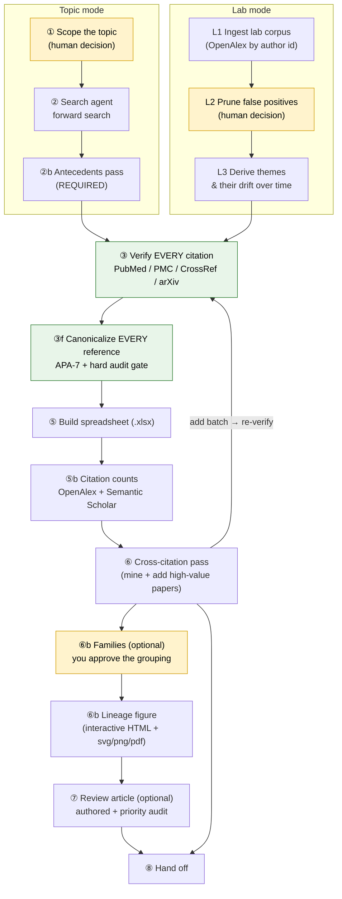
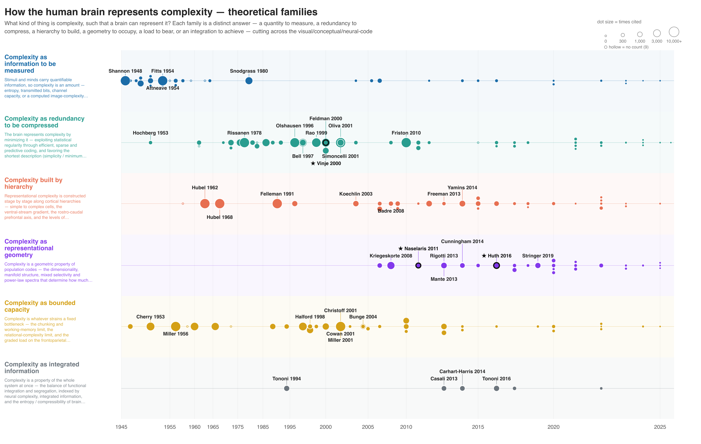

# Operator manual

This page covers everything needed to run a review: setup, the rules, each phase
with its command and its gate, how to read the outputs, and what to do when a
step fails. [Examples](examples.md) shows finished runs. The
[Tools reference](tools.md) lists every script and flag. The agent itself follows
[`PLAYBOOK.md`](https://github.com/gallantlab/literature-review-toolkit/blob/main/PLAYBOOK.md),
which is the authoritative procedure.

---

## 1. What the toolkit is for

A literature review mixes two kinds of work. A few steps need human judgment:
what to search, how to group the papers, how to write them up. Everything else
has a ground truth: a DOI either resolves to the cited paper or it does not.

The toolkit separates the two. **The agent supplies judgment; the scripts supply
ground truth.** Every checkable fact is checked automatically, behind a gate that
fails the build instead of misleading the reader. This matters because search
agents fabricate roughly **1 in 4** citations. They invent DOIs, swap first
authors, invert findings, and occasionally attach the wrong author list to a real
paper. Nothing downstream trusts an unverified reference.

**Target size.** Aim for 50–70 high-impact and recent papers per topic. Corpora of
400–650 papers work, but several figure defaults then need retuning
([§9.4](#94-the-figure-hides-landmarks-or-looks-wrong)).

### 1.1 The pipeline



<small>**Two front ends feed one verified backbone.** Topic mode (left) starts from
a question; lab mode (right) starts from a lab's publications. Both enter
verification (③), and every later phase is shared. Yellow boxes are human
decisions. Green boxes are gates: they run automatically and stop the pipeline on
any error. Papers added by the cross-citation pass (⑥) loop back through
verification, so no reference reaches a deliverable unchecked.</small>

### 1.2 The three decisions that are yours

| # | You decide | Phase | Why it is yours |
|---|---|---|---|
| 1 | **Scope**: topic and span, or which lab corpus | 1 / L1–L2 | Only you know the question. |
| 2 | **Families** *(optional)* | 6b | You approve the grouping before any paper is labeled. |
| 3 | **The write-up** *(optional)* | 7 | Prose is judgment; the toolkit does not fake it. |

---

## 2. Before you start

### 2.1 Install

```bash
git clone https://github.com/gallantlab/literature-review-toolkit.git
cd literature-review-toolkit
pip install -r requirements.txt

# Only for the opt-in PDF reconciliation in Phase 4:
brew install poppler          # macOS
# or: sudo apt-get install poppler-utils
```

The tools are standalone Python 3 scripts. The only dependencies are
`xlsxwriter` (spreadsheet) and `python-docx` (review article). Each script is
meant to be read and adapted. Run any with `--help`.

### 2.2 Environment variables

| Variable | Required | Purpose |
|---|---|---|
| `LITREVIEW_EMAIL` | yes | Contact email that NCBI and CrossRef require; it buys polite rate limits. Or pass `--email` to each tool. |
| `S2_API_KEY` | no | Avoids Semantic Scholar rate limits (HTTP 429) on large corpora. Without it, S2 coverage is partial and OpenAlex undercounts go uncaught. |
| `LITREVIEW_LAB_AUTHOR` | no | Comma-separated surnames whose papers the figure stars as home-lab work. Off by default. See [§7.2](#72-the-lineage-figure). |

```bash
export LITREVIEW_EMAIL=you@institution.edu
```

### 2.3 Where things live

Each review is its own subdirectory under a bibliography root, with the toolkit
cloned once beside them. The JSON files are the source of truth; the `.xlsx` is
rendered from them.

```text
<bibliography_root>/
├── literature-review-toolkit/              <- this repo, cloned once
├── visual_cerebellum/                      <- one review, one subdir
│   ├── visual_cerebellum_bibliography.xlsx     <-- THE DELIVERABLE
│   ├── topic_definition.md                 (scope you and the agent agreed on)
│   ├── rows.json                           (the live table; everything renders from it)
│   ├── verify_report.json                  (Phase 3 verdicts)
│   ├── citation_counts.json                (Phase 5b, cached)
│   ├── xref_visual_cerebellum.json         (Phase 6 frequency table)
│   ├── internal_citations.json             (Phase 6, within-corpus in-degree)
│   ├── families.json / families.md         (Phase 6b, if run)
│   ├── figure_render_args.txt              (Phase 6b: the exact args used)
│   ├── visual_cerebellum_families.html     (Phase 6b figure; + svg/png/pdf)
│   ├── content.json                        (Phase 7 prose, if run)
│   └── Visual_Cerebellum_review.docx       (Phase 7, if run)
└── attention/                              <- a different topic, separate subdir
```

### 2.4 How you drive it

=== "With an agent (intended)"

    Open Claude Code in the bibliography root and describe the review in plain
    English. The agent reads `PLAYBOOK.md`, creates the subdirectory, runs the
    phases, and reports when done. It asks about scope only when the request is
    ambiguous.

    ```text
    i want a literature review on the anatomical connections between the visual
    system and the cerebellum. any anatomy papers from primate or human, using
    any tractography method. go back as far as the 1970s.

    extend the existing visual_cerebellum review with another 20 papers focused
    on cerebello-thalamic projections.

    now group the world_models bibliography into a few theoretical families,
    and let's iterate on a lineage figure.
    ```

=== "By hand"

    Every phase is one script. You supply the search results as `rows.json`; the
    toolkit does the verification and bookkeeping. The commands are in
    [§5](#5-the-shared-backbone), in order.

---

## 3. The operating contract

Eight rules. The rest of this manual elaborates them.

| # | Rule | Phase |
|---|---|---|
| 1 | **Verify every citation** before it enters a deliverable, preprints included. | 3 |
| 2 | **Every reference is canonical**: rebuilt from its verified DOI, never typed by an agent or copied from a database. `--audit` is a hard gate. | 3f |
| 3 | **One row per DOI.** A paper appears once in `rows.json`. | all |
| 4 | **Run the antecedents pass on every review**, in both modes. Without it the field looks ten years old. | 2b |
| 5 | **Audit the temporal order of ideas** before delivering a written review. Origin claims cite the earliest deserving paper. | 7 |
| 6 | **After Phase 3f, `rows.json` is the live table.** Edit it by hand; never re-run the script that first emitted it. | — |
| 7 | **Fetch without asking** from PubMed, PMC, CrossRef, OpenAlex, Unpaywall, arXiv and publishers; these are read-only GETs. Every link is a bare `https://doi.org/<doi>`, never a library-proxy URL. | — |
| 8 | **PDFs are opt-in.** Default no. | 4 |

!!! danger "Rule 6 causes the most damage"
    Re-running the original row emitter after canonicalization wipes the
    canonical references and the citation counts. `common.write_rows` refuses to
    overwrite a table stamped `canonical_at`, but a project script that writes
    the file directly bypasses that guard. Edit `rows.json` in place.

---

## 4. Choosing a front end

The two modes differ only in where the corpus comes from. From verification on,
they are identical.

| | **Topic mode** | **Lab mode** |
|---|---|---|
| Starts from | a question | a lab's publications |
| Direction | searches outward | derives themes, then places them in the field |
| Front-end phases | 1 scope → 2 search → 2b antecedents | L1 ingest → L2 prune → L3 themes → L4c contextualize |
| Answers | "What is known about X?" | "What has this lab done, and where does it sit?" |

### 4.1 Topic mode

**Phase 1: scope (your decision).** Agree on the question and its span: field,
species or method restrictions, and how far back. Write it to
`topic_definition.md`, which anchors every later search.

**Phase 2: search.** Run a search with
[`tools/search_prompt_template.md`](https://github.com/gallantlab/literature-review-toolkit/blob/main/tools/search_prompt_template.md)
and save the results as `rows.json`. Links must be DOI URLs. By default, papers
older than about five years need to be highly cited or foundational; newer papers
have no citation threshold, because they have not had time to accrue citations.
Move the boundary forward as the calendar moves.

!!! tip "Give each search lane an explicit verification duty"
    Tell each lane to read the author list off the landing page, confirm that the
    DOI resolves to the right paper, and read the abstract before summarizing.
    This cuts fabrication from about 25% to near zero. A 555-paper corpus built
    this way returned 535 OK, 2 MISMATCH and 0 NOT-FOUND in Phase 3.

!!! warning "Expect a third of remembered seed titles not to exist"
    If you seed lanes with landmark titles recalled from memory, label them as
    unverified. Roughly 30–40% are not real papers. An agent told the seeds may be
    wrong substitutes genuine work; an agent not told invents a paper to match.

**Phase 2b: antecedents (required).** The forward search favors recent papers and
the topic's current framing, so it misses the field's roots. A second pass
searches three kinds of roots:

1. **Methods**: where the measurement tools came from.
2. **Foundational results**: older physiology, psychophysics and behavior.
3. **Theory**: the ideas the field is built on.

Reuse the search template with the tier flipped to favor classics, and fold the
results into the existing lanes. Pre-2000 classics, books and chapters often have
no DOI. Keep those as hand-written APA and exclude them from citation counting.

### 4.2 Lab mode

```bash
python3 ../tools/lab_corpus.py --search "Jack Gallant"           # find the OpenAlex id
python3 ../tools/lab_corpus.py --author A5056348548 --out lab_papers.json
```

**L1: ingest.** Pulls a PI's works from OpenAlex. Pass several `--author` ids (PI
plus key members) to widen coverage.

**L2: prune (your decision).** Author disambiguation is the main correctness risk
in lab mode, and it fails in both directions: OpenAlex merges same-name authors
into one id and splits one person across several. Remove false positives before
anything is themed.

**L3: derive themes.** The agent derives the lab's research themes and how their
emphasis changed over time. OpenAlex topic metadata is not enough; fetch
abstracts first. The themes become the lanes for the rest of the pipeline.

**L4c: contextualize.** Runs the full topic-mode front end (Phases 2–6) once per
theme, with the same guardrails.

The lab's own early work counts as an antecedent. An inclusion filter such as
"human fMRI only" must not drop, for example, macaque physiology that predates
the lab's human program; re-enter those papers as lab-sourced. See the
[lab-mode example](examples.md#lab-mode-the-gallant-lab-in-context) for the
resulting figures.

---

## 5. The shared backbone

Both modes run these phases. Commands assume you are in a topic subdirectory with
the toolkit at `../tools/`.

### 5.1 Phase 3: verify every citation

```bash
python3 ../tools/verify.py --rows rows.json --out verify_report.json
```

Checks every citation against PubMed, PMC, CrossRef and arXiv, and exits 0 only
when every verdict is `OK`.

| Verdict | Meaning | Action |
|---|---|---|
| `OK` | the record matches the claim | none |
| `MISMATCH` | the record resolves but disagrees on author, year or title | fix or drop the row |
| `NOT-FOUND` | every lookup completed and nothing matched | chase it; likely fabricated |
| `ERROR` | a lookup could not complete (rate limit, network) | re-run |

!!! danger "Re-run every non-OK verdict before acting on it"
    Network failures can masquerade as bad citations. When the DOI lookup errors
    and the title-search fallback does not match, the verdict is `ERROR`, not
    `MISMATCH`, but check anyway: a second run often clears it.

### 5.2 Phase 3f: canonicalize every reference

```bash
python3 ../tools/references.py --rows rows.json --out rows.json
python3 ../tools/references.py --rows rows.json --audit    # exits 1 on any defect

# then, in a reviewed pass, sentence-case the titles:
python3 ../tools/sentence_case.py --rows rows.json --proper proper_nouns.json --vocab
python3 ../tools/sentence_case.py --rows rows.json --proper proper_nouns.json --apply
```

`references.py` rebuilds every reference from its verified DOI or arXiv id into
APA-7: full author lists, name particles, real venue names (including bioRxiv and
PsyArXiv), and unescaped HTML. A journal DOI replaces an arXiv preprint as the
version of record. Only a DOI-less book or report keeps a hand-written reference.

`--audit` is a hard gate. It also warns about near-duplicate rows and multi-word
surnames that may be mis-split given names. Both need a human verdict, so read
the warnings even when the gate passes. `--repair` fixes string damage (markup,
Unicode hyphens, `?.`) offline, without re-fetching or undoing hand fixes.

!!! warning "Non-English titles are skipped by default"
    Sentence case would lowercase German nouns, so `sentence_case.py` detects and
    skips non-English titles and lists them; `--include-foreign` overrides.

After this phase, `rows.json` is the live table (contract rule 6).

### 5.3 Phase 4: PDFs (opt-in)

Off unless you ask. `download.py` tries arXiv, then Unpaywall, then EuropePMC.
`reconcile_downloads.py` files PDFs you downloaded by hand. It matches filename
to DOI first, then author, year and title on the first page, and refuses to move
any file it is unsure of.

### 5.4 Phase 5: build the spreadsheet

```bash
python3 ../tools/spreadsheet.py --rows rows.json --out my_topic_bibliography.xlsx
```

This is the core deliverable. [§7.1](#71-the-spreadsheet) explains the columns
and colors.

### 5.5 Phase 5b: citation counts

```bash
python3 ../tools/citations.py --rows rows.json --out citation_counts.json
# then re-run spreadsheet.py to add the Cite columns
```

OpenAlex is the primary source (about 95% coverage by DOI); Semantic Scholar is
the cross-check. Google Scholar has no API and blocks scripted access, so it is
not used. Counts are a snapshot: record the `--asof` date, and do not expect the
two sources to agree.

!!! warning "A famous old paper with a single-digit count is an undercount"
    OpenAlex's batch endpoint sometimes returns a stub record. Tolman (1948) came
    back as 1 from the batch and 6,656 from the single-work endpoint.
    `citations.py` re-queries when OpenAlex looks implausibly low next to S2, but
    spot-check the landmarks before delivering.

!!! warning "Not every journal DOI is the version of record"
    Before replacing a preprint's DOI, check the candidate's OpenAlex count.
    Proceedings.com DOIs for printed NeurIPS volumes (`10.52202/*`) resolve but
    are shadow records; switching to them cut counts three- to fourfold on a real
    corpus. ACL Anthology (`10.18653/*`), IEEE/CVF (`10.1109/*`) and journal DOIs
    are genuine upgrades.

### 5.6 Phase 6: cross-citation pass

```bash
python3 ../tools/xref.py --rows rows.json --exclude existing_dois.json \
        --out xref_my_topic.json --min-cites 4 --resolve-unknown \
        --internal-out internal_citations.json
```

`xref.py` tallies the corpus's own reference lists (from CrossRef) to find papers
the corpus cites often but does not contain. It usually finds 25–35 per topic.
Append the high-value ones to `rows.json` and send the batch back through Phases
3, 3f and 5.

- Four or more citations across about 40 papers is a strong signal; three is
  borderline.
- CrossRef coverage varies by publisher. Nature, Cell, OUP and J Neurosci deposit
  complete reference lists; some smaller journals deposit none.
- `--internal-out` records how often each paper is cited within the corpus. The
  figure uses this to choose landmarks, so emit it even if Phase 6b is uncertain.

!!! warning "Keep ids unique across merges"
    Assert `len(refs) == len(set(refs))` after merging, and attach citation counts
    only after ids are final. Otherwise counts attach to the wrong papers.

---

## 6. Optional phases and hand-off

### 6.1 Phase 6b: families and the lineage figure

A **family** groups papers by what they are fundamentally *for*: the theoretical
claim they support. It is orthogonal to the Topic column, which records method or
sub-area. A good family unites papers that read differently and splits papers
that read alike.

```bash
# 1. propose: the agent reads the corpus and proposes a grouping
python3 ../tools/families.py --rows rows.json --digest

# 2. CONFIRM: you approve or edit the family definitions (your decision #2)

# 3. assign, validate and stamp
python3 ../tools/families.py --rows rows.json --assign families_input.json \
        --out families.json

# 4. render
python3 ../tools/families_figure.py --rows rows.json --families families.json \
        --internal internal_citations.json --size-by-citations sqrt \
        --out-prefix my_topic_families --title "My topic — theoretical families"
```

Step 2 is the cheap checkpoint. Editing six definitions costs nothing; reassigning
300 papers does not.

!!! danger "Do not cluster embeddings to make families"
    Clustering finds surface similarity, not shared theory. `families.py`
    requires every paper to belong to exactly one family and allows 2–9 families
    (3–8 recommended). It warns when one family holds more than 60% of papers or
    has a single member.

**Write each family's `claim` and `lineage` for a reader who sees nothing else.**
Readers open the figure, not `families.md`. The figure shows the full text when
the reader hovers a lane title, and truncates the copy drawn beside the lane.
Build lineages from papers already in `rows.json`, using the canonical surname
and year; a lineage recalled from memory can be wrong in the same ways a citation
can.

**Record the exact render arguments** in `figure_render_args.txt` beside the
figure, so it can be reproduced, retuned or re-rendered in bulk.

??? tip "Tuning the figure for a large corpus"
    The label defaults (`--motif-min 3`, `--max-labels 28`) suit a 50-paper
    review. For 110–650 papers, retune per corpus and read the list of dropped
    labels, not just its length.

    | Flag | Effect |
    |---|---|
    | `--time-warp 0.85` | density-equalizing x-axis: compresses sparse early decades, expands dense recent years |
    | `--min-year 1909` | clamps the axis start; older papers pin to the left edge |
    | `--motif-min N` | a paper cited by at least N corpus papers is a landmark |
    | `--max-labels N` | caps total labels; set it above the qualifying set so it never binds |
    | `--per-family N` | labels the N most-cited papers per family (default 4) |
    | `--emphasize-source lab` | draws every row from one source as a large dot |
    | `--lab-author Surname` | rings and stars the home lab's papers (repeatable; off by default) |
    | `--lab-color '#c1121f'` | sets the ring color; quote it, or the shell treats `#` as a comment |
    | `--spec figure_spec.json` | editorial overlay: manual labels, arrows, notes, lane order |

    **Raising a threshold must not remove a label already shown.** A higher
    `--motif-min` shrinks the pool of qualifying papers, not just the cap. Compare
    label sets before and after, and choose the highest threshold that removes
    nothing.

### 6.2 Phase 7: the review article

```bash
# author the prose into content.json, after the priority audit
python3 ../tools/cite_check.py --rows rows.json --content content.json   # gate
python3 ../tools/review_paper.py --rows rows.json --content content.json \
        --figure my_topic_families.png --out My_Topic_review.docx
```

The agent writes the prose (your decision #3). Three safeguards apply:

- **Priority audit.** Before rendering, an independent pass checks that every
  origin claim cites the earliest paper that earned priority, not whichever
  reference fits the sentence. On one 396-paper review it found five priority
  inversions and four factual errors.
- **Citation gate.** `cite_check.py` exits 1 if any in-text citation does not
  match a row in `rows.json`. If one author-year matches two rows, name more
  authors (APA-7 §8.19).
- **Canonical reference list.** `review_paper.py` builds the reference list from
  `rows.json`, so it cannot drift from the verified bibliography. Entries follow
  APA-7 order: authors, then year, then title.

An AI-authored review states its author and how it was verified, once, in the
masthead.

#### Make the prose readable

First drafts are accurate but compressed: four or five findings chained through
semicolons into one 60–120 word sentence. `cite_check.py` cannot detect this,
because every citation resolves. `prose_audit.py` measures it.

```bash
cp build_review_page.py /tmp/before.py      # keep the pre-revision copy outside the project
python3 ../tools/prose_audit.py --page build_review_page.py
#   ... rewrite the sentences it lists ...
python3 ../tools/prose_audit.py --page build_review_page.py --baseline /tmp/before.py
```

The tool reads a review page script (`--page`, `[[REF]]` markers) or a
`content.json` (`--content`, APA author-date citations). It reports words, mean
sentence length and long sentences per block. Aim for a mean near 24 words, with
almost nothing over 50; first drafts typically average 31. Fix each listed
sentence by giving each finding its own sentence.

- **`--baseline` is a gate.** Splitting sentences is how a reference silently
  falls out of the works cited. The flag compares the set of cited references
  before and after and exits 1 on any loss.
- **It flags arguments made twice.** Block pairs that share eight or more
  citations are reported. Before merging two such sections, confirm that every
  reference in the removed one is cited elsewhere.

Long sentences are reported, not gated: a list-like sentence can legitimately run
long.

#### The review web page

The `.docx` is the manuscript. The readable deliverable is a self-contained HTML
page, built by a project-local `build_review_page.py` from the same `rows.json`.
It carries two things:

1. the **numbered works cited**, which resolve the in-text citations;
2. the **interactive lineage figure** (`<topic>_families.html`) in an iframe, on
   every review. It doubles as the corpus browser: clicking a paper shows its
   reference, family, topic, DOI, summary and citation counts.

Do not add a second reference browser; the figure's panel already shows
everything it would.

For a corpus with no figure, `bib_viewer.py` renders a searchable bibliography
grouped by family, with a note stating who wrote the summaries and that they come
from abstracts:

```bash
python3 ../tools/bib_viewer.py --rows rows.json --families families.json \
        --out corpus_viewer.html --title "My topic" \
        --author "<model>" --author-note "<what the model is>"
```

It can also be embedded in a page (`bib_viewer.render()`, plus `bib_viewer.CSS`
and `bib_viewer.JS`); pass `provenance=False` where the masthead already carries
the disclosure. Verify the viewer's filter by running it, not by reading it:
`node verify_bib_filter.mjs <page>.html` executes the page's script against a
stub DOM and checks what is visible.

### 6.3 Phase 8: hand off

Deliver the `.xlsx`, plus the figure and review if you ran those phases. **Keep
the JSON files with the deliverable.** They are the audit trail and the input to
any later re-run.

---

## 7. Reading what comes out

### 7.1 The spreadsheet

One row per paper. Columns: `Topic · Ref# · APA reference · Link · Summary · Tag ·
Family · Cite (OpenAlex) · Cite (S2) · Verify note · PDF (local) · Xref`. The
`Family`, `Cite` and `Verify note` columns appear once any row carries them.
`Link` is always the bare DOI URL.

Row color records where each paper came from:

<p>
<span class="swatch source"></span> cited in your source document &nbsp;·&nbsp;
<span class="swatch search"></span> agent search &nbsp;·&nbsp;
<span class="swatch anteced"></span> antecedents pass &nbsp;·&nbsp;
<span class="swatch xref"></span> cross-citation pass &nbsp;·&nbsp;
<span class="swatch lab"></span> the lab's own papers (lab mode)
</p>

An unknown source renders white, with a warning.

<div markdown>
--8<-- "docs/_includes/bib_table.html"
</div>

<small>**Six rows from a finished bibliography.** Taken from
`complexity_representation` (190 papers), with the `Link` column omitted. Each row
pairs a canonical APA-7 reference with a one-sentence summary written from the
abstract, the paper's family, and its citation counts from OpenAlex (OA) and
Semantic Scholar (S2). Cream rows came from the agent's search; green rows were
added by the cross-citation pass. The two count columns agree closely,
and a blank marks a paper that one source could not find.</small>

### 7.2 The lineage figure

The `.html` file is self-contained: no network, no dependencies. Open it in a
browser.

<figure class="fig" markdown>
{ loading=lazy }
<figcaption markdown>
**A lineage figure shows which ideas a field is built on and when each appeared.**
The corpus is `complexity_representation`: 190 verified papers on how the brain
represents complexity. Each horizontal lane is one theoretical family, labeled at
left with its claim. Each dot is a paper placed by publication year; dot area is
proportional to citation count (legend, top right), and a hollow dot has no count.
Labeled dots are landmarks, chosen automatically by citation count and by how
often the corpus itself cites them. Ringed, starred dots are home-lab papers. The
x-axis is warped (`--time-warp 0.85`) so that the sparse decades before 1995 take
less room than the dense recent years. The early lanes (information, compression,
capacity) rest on landmarks from the 1950s; the geometry lane starts only in the mid-2000s,
and the integration lane holds few papers. The figure therefore shows which
families are mature and which are new, before any paper is read.
</figcaption>
</figure>

| What you see | What it means |
|---|---|
| **A horizontal lane** | one theoretical family |
| **A dot** | one paper, placed by year |
| **Dot size** | citation count (with `--size-by-citations`) |
| **A hollow dot** | no citation count available; not a count of zero |
| **A labeled dot** | an automatically selected landmark |
| **A ring and a ★** | a home-lab paper (only when opted in) |

| What you do | What happens |
|---|---|
| **Hover a dot** | shows its full reference |
| **Click a dot** | opens a panel with the reference, summary, counts and a DOI link |
| **Hover or focus a lane title** | shows the family's claim, lineage and paper count, and highlights its papers |
| **Next / Prev, or ← →** | steps through papers in year order, top to bottom within each year |
| **"stay in this family"** | confines the walk to one lane |
| **⬇ Download table** | downloads the embedded `.xlsx`, if `--xlsx` was passed |

**Dot size.** `--size-by-citations sqrt` makes dot area proportional to citation
count. Counts span four orders of magnitude, so the scale tops out at the 95th
percentile and clamps anything above it; otherwise one classic would shrink every
other dot. (`log` is available but makes most dots look alike.) Citation count
also depends on age, so recent papers draw small. Say so when presenting the
figure.

**Landmarks.** Selection is automatic; do not hand-build a label overlay. A paper
is a landmark if it is among its family's `--per-family` most cited, if at least
`--motif-min` corpus papers cite it (requires `--internal`), or if it is a
home-lab paper. Each run prints how many labels the cap dropped. Only arrows and
notes are editorial (`--spec`).

**Home-lab papers.** Starring is off by default, so the toolkit stays neutral.
Turn it on with `--lab-author Surname` (repeatable) or `LITREVIEW_LAB_AUTHOR`.
Rows with `source == "lab"`, which lab mode produces, are always starred.
`--lab-color` sets the ring color. The default gold matches the fifth family's
lane color, so when it would collide, the figure picks another color and says so.

### 7.3 The review article

A `.docx` with an abstract, the authored prose, the figure, an AI-authorship
disclosure, and a canonical APA-7 reference list built from `rows.json`. See the
[example pages](examples.md#a-finished-review-article).

---

## 8. Extending or re-running a review

**To add papers**, append the new rows to `rows.json` and run Phases 3, 3f and 5
on them. Re-run 5b and 6 to refresh counts and cross-citations. Never re-run the
original row emitter (contract rule 6).

**To re-render a figure** after a toolkit change, re-run the command in
`figure_render_args.txt`, then compare the label set with the previous `.svg`. A
re-render should change the drawing, not the landmarks; if labels moved, find out
why before shipping.

**To re-render a review** after a toolkit or corpus change, render it to a
scratch path first and compare the prose with the delivered `.docx`. If only the
reference list differs, replace the file. If the prose differs too, the delivered
file holds edits or is an older draft, and re-rendering would overwrite them.

!!! tip "Confirm the renderer is deterministic first"
    Render twice with unchanged code and data. Any difference is a renderer bug,
    and it would make every later comparison meaningless.

---

## 9. When something goes wrong

### 9.1 Network failures that look alike

Three different failures all look like "the fetch broke". Backing off fixes only
the first.

| Symptom | Cause | Fix |
|---|---|---|
| HTTP 429s, spread across many URLs, easing with delay | throttling | raise `--sleep`; set `S2_API_KEY` |
| `IncompleteRead` on particular large records, failing at the same byte count every time | truncated uncompressed response | request gzip; `common.http` already does |
| One URL fails under `urllib` but works under `curl` | client incompatibility | `common.curl_get`, which the tools try automatically |

If retries never converge, you have the wrong diagnosis. Running
`curl -sS --compressed` on one failing URL tells you which case applies.

### 9.2 The audit gate fails

`references.py --audit` names each defect: an empty venue, a missing year, a
malformed initial, a footnote digit glued to the title. Fix the row in
`rows.json` and re-run. Do not relax the gate.

Sometimes the source is wrong, not your corpus:

- **CrossRef truncates some records**: an author list cut to one name, a
  subtitle dropped, a section heading deposited as the title. Compare with the
  publisher's landing page.
- **A widely used DOI can be wrong.** PubMed and CrossRef confuse Felleman & Van
  Essen (1991) with that issue's preface, and 19 papers in one corpus cited the
  preface DOI. A `MISMATCH` sometimes means the literature is wrong.

### 9.3 Verification returns NOT-FOUND for real papers

Usually arXiv rate limiting. `verify.py` batches arXiv lookups to prevent this,
but if a cluster of preprints comes back NOT-FOUND, re-run before treating them
as fabrications.

### 9.4 The figure hides landmarks or looks wrong

- **Labels missing.** The cap bound. Each run prints "N qualified, M labeled, K
  dropped"; read the dropped list, not just the count.
- **Dots bunched at the left.** Use `--time-warp 0.85` and `--min-year`.
- **A family's claim is cut off.** The drawn copy is truncated to fit its lane;
  the full text appears on hover.
- **Many hollow dots.** The corpus has poor citation-count coverage. Check
  coverage before reading anything into dot sizes.

### 9.5 Counts look implausible

A famous old paper with a single-digit OpenAlex count is an undercount; compare
the S2 column. See [§5.5](#55-phase-5b-citation-counts).

---

## 10. Reference card

### Rate limits

| API | Limit |
|---|---|
| arXiv | about 1 request per 3 s; bursts return 429 |
| NCBI E-utilities | 3 requests/s without a key, 10 with; use a 0.4 s sleep |
| CrossRef | polite pool (with `mailto:`) is unthrottled; otherwise about 50/s |
| Unpaywall | 100,000 requests per day per email |

### Cost and time

For about 40 searched plus 30 cross-citation papers, without PDFs, an agent uses
roughly **1–2M tokens** and **5–10 minutes**. The cross-citation pass (Phase 6) is
the slowest step, at 3–5 minutes. PDF download (Phase 4) adds 10–20 minutes.

### Tools and flags

The [Tools reference](tools.md) lists every script and flag, generated from the
code. Run any script with `--help`.

### Changing the toolkit

Update the affected docs page in the same change. See
[Maintaining this site](maintaining.md).
