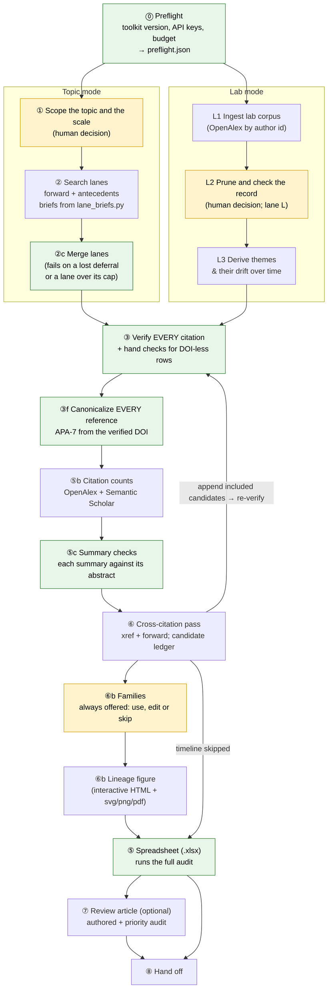

# Operator manual

This page covers what you need to run a review: setup, the rules, each phase
with its command and its gate, how to read the outputs, and what to do when a
step fails. [Examples](examples.md) shows finished runs. The
[Tools reference](tools.md) lists every script and flag. The agent itself follows
[`PLAYBOOK.md`](https://github.com/gallantlab/literature-review-toolkit/blob/main/PLAYBOOK.md),
which is the authoritative procedure.

---

## 1. What the toolkit is for

A literature review mixes two kinds of work. A few steps need human judgment:
what to search, how to group the papers, how to write them up. Everything else
has a ground truth: a DOI either resolves to the cited paper or it does not.

The toolkit separates the two. **The agent supplies judgment; the scripts supply
ground truth.** Every checkable fact is checked by a script, behind a gate that
fails the build instead of misleading the reader. This matters because, without a
duty to verify, search agents got about **1 in 4** citations wrong. They invented
DOIs, swapped first authors, inverted findings, and sometimes attached the wrong
author list to a real paper. Every lane brief now carries that duty
([§4.1](#41-topic-mode)), and still nothing downstream trusts an unverified
reference. Summaries get the same
treatment: each one is checked against its paper's abstract.

**Size.** You set the size of the search when you describe the review, from a
quick scan to an exhaustive search ([§4.1](#41-topic-mode)). Every check runs at
every size. Builds so far have run from about 50 to over 1,100 papers. Above about
110 papers, several figure defaults need retuning
([§9.4](#94-the-figure-hides-landmarks-or-looks-wrong)).

### 1.1 The pipeline


```mermaid
flowchart TD
    P["⓪ Preflight<br/>toolkit version, API keys, budget<br/>→ preflight.json"]

    subgraph TOPIC["Topic mode"]
      T1["① Scope the topic and the scale<br/>(human decision)"]
      T2["② Search lanes<br/>forward + antecedents<br/>briefs from lane_briefs.py"]
      T2b["②c Merge lanes<br/>(fails on a lost deferral<br/>or a lane over its cap)"]
      T1 --> T2 --> T2b
    end

    subgraph LAB["Lab mode"]
      L1["L1 Ingest lab corpus<br/>(OpenAlex by author id)"]
      L2["L2 Prune and check the record<br/>(human decision; lane L)"]
      L3["L3 Derive themes<br/>& their drift over time"]
      L1 --> L2 --> L3
    end

    P --> T1
    P --> L1
    T2b --> V
    L3 --> V

    V["③ Verify EVERY citation<br/>+ hand checks for DOI-less rows"]
    C["③f Canonicalize EVERY reference<br/>APA-7 from the verified DOI"]
    CC["⑤b Citation counts<br/>OpenAlex + Semantic Scholar"]
    SC["⑤c Summary checks<br/>each summary against its abstract"]
    X["⑥ Cross-citation pass<br/>xref + forward; candidate ledger"]
    F["⑥b Families<br/>always offered: use, edit or skip"]
    FIG["⑥b Lineage figure<br/>(interactive HTML + svg/png/pdf)"]
    S["⑤ Spreadsheet (.xlsx)<br/>runs the full audit"]
    W["⑦ Review article (optional)<br/>authored + priority audit"]
    H["⑧ Hand off"]

    V --> C --> CC --> SC --> X
    X -->|"append included candidates → re-verify"| V
    X --> F --> FIG --> S
    X -->|"timeline skipped"| S
    S --> W --> H
    S --> H

    classDef human fill:#fff3cd,stroke:#d39e00,color:#000;
    classDef gate fill:#e8f5e9,stroke:#2e7d32,color:#000;
    class T1,L2,F human;
    class P,T2b,V,C,SC,S gate;
```

<small>**Two front ends feed one verified backbone.** The preflight (⓪) runs
before any search, and the merge (②c) refuses to build a table without its record.
Topic mode (left) starts from a question; lab mode (right)
starts from a lab's publications. Both enter verification (③), and every later
phase is shared. Yellow boxes are human decisions. Green boxes are gates: each one
stops the pipeline on an error. Papers added by the cross-citation pass (⑥) loop
back through verification, so no reference reaches a deliverable unchecked. The
spreadsheet keeps the playbook's phase number (⑤) but runs last, because it is
the release gate. The timeline is offered on every review; the path from ⑥
straight to the spreadsheet is taken only when you skip it.</small>

### 1.2 The pipeline as commands

```
 0. preflight.py --project <topic>/ --scale <scan|focused|standard|exhaustive|N>
      Exit 2: stop. Offer the newer toolkit if there is one. If API access
      is short, choose: get the keys, cap the search, or be prepared to wait.
      Record the choice with --accept cap|wait|current-version.
 1. Scope the topic and its scale (your decision). Describe the lanes in
      lanes.json; lane_briefs.py --spec lanes.json writes every brief.
      Launch the forward and antecedent lanes together.
 2. merge_lanes.py --raw search_raw --out rows.json
      Needs a cleared preflight.json. A lost deferral fails the merge: send
      it to one recovery lane, add its file, and re-merge. A capped lane
      over its cap also fails it. Resume any lane flagged as thin.
 3. verify.py --rows rows.json --out verify_report.json
      Fix or drop each MISMATCH and NOT-FOUND, or clear a false alarm with
      --override. Meanwhile, run handcheck.py --prepare and the hand-check
      agent for the DOI-less rows; run --ingest after verify finishes.
 4. Pitch the proposed families to the user (families.py --digest).
 5. In parallel with references.py (canon), run citations.py (fetch only),
      xref.py and abstracts.py; they share the Semantic Scholar key's pace.
      After canon, citations.py --attach-only; then run forward.py, which
      ranks its landmarks by xref's output and the counts.
 6. candidates.py --add the xref and forward results; decide each one with
      a reason; --export-included, merge_lanes.py --append, then verify
      (or hand-check), canon and citation counts for the new rows.
 7. sentence_case.py in a reviewed pass. Record each hand fix in
      hand_fixes.json; canon and sentence_case.py re-apply them.
 8. summary_audit.py --prepare, the checking agents, --ingest. Fix each
      flagged summary and check it again.
 9. families.py --assign (read the hard calls it prints), then
      families_figure.py (unless the timeline was skipped at 4).
10. Acknowledge each remaining warning in audit_acks.json.
11. spreadsheet.py: runs the full audit and writes the deliverable only
      if it passes.
```

### 1.3 The three decisions that are yours

| # | You decide | Phase | Why it is yours |
|---|---|---|---|
| 1 | **Scope and size**: the topic and its span, or which lab corpus; and how big a search | 1 / L1–L2 | Only you know the question and how much of the field you need. |
| 2 | **Families and the timeline** | 6b | The agent always offers the timeline and proposes its families; you use them, change them, or skip the timeline. |
| 3 | **The write-up** *(optional)* | 7 | Prose is judgment; the toolkit does not fake it. |

The preflight can add a fourth: when API access is short, you choose how the
build proceeds, and the choice is recorded
([§2.3](#23-phase-0-run-the-preflight-before-every-new-search)).

---

## 2. Before you start

### 2.1 Install

```bash
git clone https://github.com/gallantlab/literature-review-toolkit.git
cd literature-review-toolkit
pip install -r requirements.txt

# Only for the opt-in PDF reconciliation in Phase 4:
brew install poppler          # macOS
# or: sudo apt-get install poppler-utils
```

The tools are standalone Python 3 scripts. Their only dependencies are
`xlsxwriter` (spreadsheet) and `python-docx` (review article). The figure's PNG
and PDF exports also need `rsvg-convert` or Inkscape; without either, you get the
HTML and SVG only. Each script is meant to be read and adapted. Run any of them
with `--help`.

### 2.2 Environment variables

| Variable | Required | Purpose |
|---|---|---|
| `LITREVIEW_EMAIL` | yes | The contact email that NCBI and CrossRef require; it earns polite rate limits. Every network tool reads it, and `--email` overrides it. |
| `OPENALEX_API_KEY` | effectively yes | Gives your build its own OpenAlex budget. Without it, every client on your IP address shares one daily budget ([§2.3](#23-phase-0-run-the-preflight-before-every-new-search)). Keys are free: help.openalex.org/api/authentication. |
| `S2_API_KEY` | strongly recommended | Without it, Semantic Scholar throttles hard: `xref.py` and the S2 citation counts take hours and leave gaps. `xref.py` also needs it for arXiv papers' reference lists, which CrossRef does not hold. Keys are free: semanticscholar.org/product/api. |
| `LITREVIEW_LAB_AUTHOR` | no | Comma-separated surnames whose papers the figure stars as home-lab work. Off by default. See [§7.2](#72-the-lineage-figure). |

```bash
export LITREVIEW_EMAIL=you@institution.edu
export OPENALEX_API_KEY=...   # free key from openalex.org
export S2_API_KEY=...         # free key from semanticscholar.org
```

The toolkit sends the OpenAlex key as an `Authorization` header, and only to
`api.openalex.org`, so it never appears in a URL or a log line. One Semantic
Scholar key serves `citations.py`, `xref.py` and `abstracts.py`. Their requests
take turns through one pacer, a lock file shared by every toolkit process on the
machine. So the three may run at the same time without drawing each other's 429s.

### 2.3 Phase 0: run the preflight before every new search

A build runs for hours, and two of its services ration keyless use. To find out
before the build starts whether it can finish, create the project folder and run
the preflight from the bibliography root:

```bash
mkdir -p <topic>
python3 tools/preflight.py --project <topic>/ --scale focused
```

`--scale` is the size of search you asked for (`scan`, `focused`, `standard`,
`exhaustive` or a number of papers; see [§4.1](#41-topic-mode)). Add `--lanes N`
if you know the lane count. The preflight sizes its budget estimate to the scale;
`--papers` gives the planned corpus size directly instead (default 500). The
preflight does four things:

1. **Checks for a newer toolkit.** The toolkit is updated often. The preflight
   compares this copy's version with the one on GitHub. When GitHub is newer, it
   prints the install command: `git -C <toolkit> pull --ff-only` for a clone, or
   the Claude Code `/plugin` menu or a fresh download otherwise.
2. **Checks the variables** `LITREVIEW_EMAIL`, `OPENALEX_API_KEY` and `S2_API_KEY`.
3. **Probes OpenAlex and Semantic Scholar** with one request each, and reads how
   much of today's OpenAlex budget is left.
4. **Estimates the OpenAlex credits** a build of that size needs, and the largest
   build today's budget can cover.

A build already under way keeps the version it started with: pass
`--no-update-check`. `--offline` checks the variables only, with no probes and no
version check.

Exit 0 means the build can run as planned. Exit 2 means you decide first. A newer
toolkit is offered for you to install or decline; after an install, rerun the
preflight. A missing `LITREVIEW_EMAIL` also exits 2: set it and rerun. When a key
is missing or the budget is short, the preflight prints three choices:

- **Get the API keys.** Both are free, and each has its own budget. Add the export
  lines to your shell profile, open a new shell, and rerun the preflight.
- **Cap the search.** Use fewer lanes and a hard per-lane cap, sized so the build
  fits the budget: a capped scale (`scan`, `focused` or a number of papers). Every
  lane brief then says the search is capped, and each lane lists the on-topic
  papers over its cap in `excluded`, with reason `over the capped-search limit`.
  Those papers appear on the spreadsheet's "Considered and excluded" sheet instead
  of being lost. Without `S2_API_KEY`, also run `xref.py --allow-incomplete` and
  say so at hand-off.
- **Be prepared to wait.** Nothing is skipped, but it takes longer. An OpenAlex step
  that runs out of budget stops with `OpenAlexBudgetError`; rerun it after the
  budget resets at midnight UTC. A large build can need more than one day.
  Semantic Scholar steps back off on every 429 and can take hours on a large corpus.

**The record is a gate.** Every run writes `preflight.json` into the project
folder; if the folder does not exist yet, nothing is recorded. `merge_lanes.py`,
the step that first builds the table, refuses to run without a record that is at
most 14 days old and cleared. A record is cleared when everything passed, or when
you have recorded your choice. After a key or budget stop, rerun with `--accept
cap` or `--accept wait`. To keep this toolkit instead of updating, add `--accept
current-version`. A run whose every stop is accepted exits 0. A missing email can
never be accepted. After a cap choice, `lane_briefs.py` refuses an uncapped scale
([§4.1](#41-topic-mode)). To merge without a record, pass `merge_lanes.py
--no-preflight "reason"`; the reason is kept in `merge_report.json`.

**The OpenAlex budget.** Without a key, OpenAlex gives each IP address 1,000
credits a day, shared by every client behind it. A key has its own 10,000. The
cost of each kind of request is in the [reference card](#10-reference-card).
OpenAlex serves the citation counts, abstracts, forward citations, the hand-check
DOI search and `lab_corpus.py`. On a campus network, others may have spent the
shared budget before you start: on 2026-09-27 one campus network had spent it by
06:30 UTC. A spent budget shows as a 429 that asks for a wait of more than 10
minutes. Because backing off cannot help, the tools then stop at once with
`OpenAlexBudgetError` instead of waiting.

### 2.4 Where things live

Each review is its own subdirectory under a bibliography root, with the toolkit
cloned once beside them. The JSON files are the source of truth; the `.xlsx` is
rendered from them. The commands in §4 onward run inside a review's subdirectory
and reach the scripts as `../tools/`. To make that path work, link the toolkit's
`tools` folder once in the bibliography root:
`ln -s literature-review-toolkit/tools tools`.

```text
<bibliography_root>/
├── literature-review-toolkit/              <- this repo, cloned once
├── tools -> literature-review-toolkit/tools    (the link the commands use)
├── visual_cerebellum/                      <- one review, one subdir
│   ├── visual_cerebellum_bibliography.xlsx     <-- THE DELIVERABLE
│   ├── preflight.json                      (Phase 0 record; the merge requires it)
│   ├── topic_definition.md                 (scope you and the agent agreed on)
│   ├── lanes.json                          (Phase 2 lane spec, with the scale)
│   ├── briefs/, lane_manifest.json         (Phase 2: the generated lane briefs)
│   ├── search_raw/                         (Phase 2: one lane file per lane)
│   ├── merge_report.json                   (Phase 2c: deferrals, exclusions, thin lanes)
│   ├── rows.json                           (the live table; everything renders from it)
│   ├── verify_report.json                  (Phase 3 verdicts)
│   ├── handcheck_input.json, handcheck_result.json   (Phase 3 hand checks)
│   ├── hand_fixes.json                     (Phase 3f fixes that survive a re-canon)
│   ├── citation_counts.json                (Phase 5b, cached)
│   ├── abstracts.json, summary_audit/      (Phase 5c summary checks)
│   ├── xref_visual_cerebellum.json         (Phase 6 frequency table, + .run.json, .refs.json)
│   ├── .record_cache/                      (registry records verify fetched; canon reuses them)
│   ├── forward_candidates.json             (Phase 6 forward citations, + .run.json)
│   ├── internal_citations.json             (Phase 6, within-corpus in-degree)
│   ├── candidates.json                     (Phase 6 candidate ledger)
│   ├── audit_acks.json                     (acknowledged audit warnings)
│   ├── families.json / families.md         (Phase 6b, if run)
│   ├── figure_render_args.txt              (Phase 6b: the exact args used)
│   ├── visual_cerebellum_families.html     (Phase 6b figure; + svg/png/pdf)
│   ├── content.json                        (Phase 7 prose, if run)
│   └── Visual_Cerebellum_review.docx       (Phase 7, if run)
└── attention/                              <- a different topic, separate subdir
```

### 2.5 How you drive it

=== "With an agent (intended)"

    Open Claude Code in the bibliography root and describe the review in plain
    English, including how big a search you want. The agent reads `PLAYBOOK.md`,
    creates the subdirectory, runs the preflight, runs the phases, and reports
    when done. It asks about scope only when the request is ambiguous.

    ```text
    i want a literature review on the anatomical connections between the visual
    system and the cerebellum. any anatomy papers from primate or human, using
    any tractography method. go back as far as the 1970s.

    give me a quick look at the key papers on predictive coding in the retina.

    extend the existing visual_cerebellum review with another 20 papers focused
    on cerebello-thalamic projections.

    now group the world_models bibliography into a few theoretical families,
    and let's iterate on a lineage figure.
    ```

=== "By hand"

    Every phase is one script. You supply the search results as lane files; the
    toolkit does the verification and bookkeeping. The commands are in
    [§5](#5-the-shared-backbone), in order.

---

## 3. The operating contract

Ten rules. The rest of this manual elaborates them.

| # | Rule | Phase |
|---|---|---|
| 0 | **Check for a newer toolkit and for API access before any search**: `preflight.py`. If it exits 2, stop. Offer the newer version if there is one. If access is short, let the user choose: get the keys, cap the search, or be prepared to wait. The merge refuses to run until the record is cleared. | 0 |
| 1 | **Verify every citation** before it enters a deliverable, preprints included. `verify.py --rows` stamps each row; canon and the audit refuse a row without an OK stamp for its current ids. | 3 |
| 2 | **Every reference is canonical**: rebuilt from its verified DOI, never typed by an agent or copied from a database. Canon's refusal to rebuild an unverified row is unconditional, on every table. `--audit` is a hard gate. | 3f |
| 3 | **One row per DOI.** A paper appears once in `rows.json`. | all |
| 4 | **Run the antecedents pass on every review**, in both modes and at every scale. Without it the field looks ten years old. `lane_briefs.py` refuses a spec with no antecedent lane. | 2b |
| 5 | **Audit the temporal order of ideas** before delivering a written review. Origin claims cite the earliest deserving paper. | 7 |
| 6 | **From the first merge on, `rows.json` is the live table.** Add rows only with `merge_lanes.py --append`, and change them only through the tools or by hand. Never regenerate it. | 2c |
| 7 | **Fetch without asking** from PubMed, PMC, CrossRef, OpenAlex, Unpaywall, arXiv and publishers; these are read-only GETs. Every link is a bare `https://doi.org/<doi>`, never a library-proxy URL. | — |
| 8 | **PDFs are opt-in.** Default no. | 4 |
| 9 | **The spreadsheet is the release gate.** It runs the full audit and refuses a failing table; `--draft` writes one marked as a draft. | 5 |

!!! danger "Rule 6 causes the most damage"
    Regenerating `rows.json`, by a fresh `merge_lanes.py --raw --out` or a
    project row emitter, drops every stamp, hand check and summary check written
    since. After canon it also wipes the canonical references, the citation
    counts and the families. `common.write_rows` refuses to overwrite a table
    stamped `canonical_at`, but a project script that writes the file directly
    bypasses that guard. Edit `rows.json` in place, and record a fix to a
    reference in `hand_fixes.json` ([§5.3](#53-phase-3f-canonicalize-every-reference)).

---

## 4. Choosing a front end

The two modes differ only in where the corpus comes from. From verification on,
they are identical.

| | **Topic mode** | **Lab mode** |
|---|---|---|
| Starts from | a question | a lab's publications |
| Direction | searches outward | derives themes, then places them in the field |
| Front-end phases | 1 scope → 2 search → 2b antecedents → 2c merge | L1 ingest → L2 prune → L3 themes → L4c contextualize |
| Answers | "What is known about X?" | "What has this lab done, and where does it sit?" |

### 4.1 Topic mode

**Phase 1: scope (your decision).** Agree on the question and its span: field,
species or method restrictions, and how far back. Write it to
`topic_definition.md`, which anchors every later search.

**Phase 1: the size of the search (your decision).** Say it in your own words when
you describe the review. The agent maps it to a scale, passes it to the preflight
([§2.3](#23-phase-0-run-the-preflight-before-every-new-search)), and writes it into
the lane spec:

| Scale | You say | Papers per lane | Capped | Lanes |
|---|---|---|---|---|
| `scan` | "a quick look", "the key papers" | 15 | yes | 2-4 |
| `focused` | "the core literature" | 30 | yes | 3-8 |
| `standard` | nothing about size (the default) | 40, a floor | no | 4-12 |
| `exhaustive` | "everything", "comprehensive" | 60, a floor | no | 6-20 |
| a number | "about 300 papers" | the total spread over the lanes | yes | up to 50 |

A lane may set its own target. A smaller scale means fewer papers, never fewer
checks: every gate runs at every scale, and every scale needs an antecedent lane.

**Phase 2: search.** Each search lane is an agent with its own generated brief;
never fill one by hand. To make the briefs, describe the lanes in a spec,
`lanes.json`, in the project folder:

```json
{"title": "Anatomical connections between the visual system and the cerebellum",
 "for": "<who the review is for>",
 "description": "What the bibliography covers, and what is out of scope for every lane.",
 "scale": "focused",
 "lanes": [{"key": "A", "name": "Cerebello-thalamic projections",
            "short": "one line for the lane table", "kind": "forward",
            "definition": "...", "exclusions": ["..."], "queries": ["..."],
            "seeds": ["a landmark title, no author"]},
           {"key": "R", "name": "Roots: tract-tracing methods", "kind": "antecedent", "...": "..."}]}
```

The example shows two of its lanes; a `focused` spec needs three to eight.

Then run `python3 ../tools/lane_briefs.py --spec lanes.json`. It fills
[`tools/search_prompt_template.md`](https://github.com/gallantlab/literature-review-toolkit/blob/main/tools/search_prompt_template.md)
for each lane and keeps only the blocks that apply: forward or antecedent, capped
or uncapped, lab mode, seeds. It writes `briefs/brief_<KEY>.md`,
`lane_manifest.json` and an empty `search_raw/`, and prints the prompt to give each
search agent and a preflight command sized to the plan. Lab mode adds `"lab":
{"pi": ..., "lane": "L"}` ([§4.2](#42-lab-mode)).

The tool refuses a spec with any of these problems, and names each one:

- a missing field, a repeated lane key, or a seed that names an author;
- a lane count outside the scale's range, or no antecedent lane;
- an uncapped scale after you chose, at the preflight, to cap the search;
- a brief with anything left unfilled.

So every brief carries the verification duty and the other rules. Each lane agent
writes one JSON lane file (schema 2) into `search_raw/`. Links must be DOI URLs.
Papers older than the tier boundary (the spec's `tier`, by default five years
before today) need to be highly cited or foundational. Newer papers have no
citation threshold, because they have not had time to accrue citations.

A lane file has four lists:

| List | What goes in it |
|---|---|
| `papers` | every on-topic paper the lane keeps. Each needs a DOI or an arXiv id; a book or report with neither needs its full APA reference. |
| `deferred` | a **hand-off**: a paper for another, named lane (`to_lane`), with its `first_author` and `year` |
| `excluded` | a **decision**: a paper outside the scope, or an older paper that does not clear the classic bar, with its `reason`, `first_author` and `year` |
| `could_not_confirm` | a paper the lane could not confirm exists |

**In an uncapped search, the target is a floor.** A lane never drops an on-topic
paper to stay near its target; "trimmed to target" is not a reason. On recent
builds, uncapped lanes returned about three times their target. On the first
reference-gated build (2026-09-26), eleven lanes deferred 138 papers that no lane
kept, most of them "trimmed to target". Without the merge's deferral check, every
one of them would have been lost without notice.

**In a capped search, the target is a hard cap.** Each lane keeps its most
important papers and lists every other on-topic paper in `excluded`, with reason
`over the capped-search limit`. The merge fails a capped lane that returns more
than its cap.

!!! tip "Why every brief carries a verification duty"
    The brief tells each lane to read the author list off the landing page,
    confirm that the DOI resolves to the right paper, and read the abstract before
    summarizing. Without that duty, about 1 in 4 citations came back wrong. A
    555-paper corpus built with it returned 535 OK, 2 MISMATCH and 0 NOT-FOUND in
    Phase 3.

!!! warning "Expect a third of remembered seed titles not to exist"
    Roughly 30–40% of landmark titles recalled from memory are not real papers.
    The brief therefore labels seeds as unverified titles, and `lane_briefs.py`
    refuses a seed that names an author. An agent told the seeds may be wrong
    substitutes genuine work; an agent not told invents a paper to match.

**Phase 2b: antecedents (required).** The forward search favors recent papers and
the topic's current framing, so it misses the field's roots. A second set of
lanes searches three kinds of roots:

1. **Methods**: where the measurement tools came from.
2. **Foundational results**: older physiology, psychophysics and behavior.
3. **Theory**: the ideas the field is built on.

Give these lanes `"kind": "antecedent"` in the spec; their briefs favor classics.
Launch them with the forward lanes; they write into the same `search_raw/`.
Pre-2000 classics, books and chapters often have no DOI. Those keep a hand-written
APA reference, get a hand check in Phase 3
([§5.2](#52-phase-3-hand-check-the-references-with-no-doi)), and get no citation
count.

**Phase 2c: merge the lanes (a gate).** Once every lane has finished, merge the
lane files into `rows.json`:

```bash
python3 ../tools/merge_lanes.py --raw search_raw --out rows.json
```

The merge first reads `preflight.json` from the project folder, and stops if no
cleared record under 14 days old is there
([§2.3](#23-phase-0-run-the-preflight-before-every-new-search)).

`merge_lanes.py` dedups by DOI, then arXiv id, then normalized title plus year. It
keeps each lane's claim as `search_author`, `search_year` and `search_title`,
which verification checks the DOI against. A title-and-year match alone is a hint,
not a merge. It counts as the same paper only when the lanes' claimed authors and
years agree and the rows do not carry two *different* journal DOIs. (A preprint
DOI and its own journal DOI are not a conflict.) Otherwise both rows are kept and
reported as a possible pair. After the merge, it also compares the titles of every
pair of kept rows. Any pair with a similarity of 0.9 or more, whatever the year
or DOI, is listed as a possible duplicate. A title of fewer than four content words
must match character by character, so a short title such as "The human visual
cortex" does not pair with every longer title that contains its words.

Exclusions never have to match a row. The merge records them in
`merge_report.json`, and the spreadsheet lists every exclusion that no lane kept
on its "Considered and excluded" sheet. A paper missing from the table is then
visibly one that a lane decided against.

**When the merge fails.** In each of these cases the merge writes
`merge_report.json` but not `rows.json`, and exits 1:

- **A lost deferral**: a deferred paper that no lane's `papers` matched by DOI,
  arXiv id or title. A title match needs a similarity of 0.9 or more, or each
  title's words at least 90% contained in the other. It must also be confirmed by
  the deferral's `first_author` or `year`. Send the lost papers to one recovery
  lane, add its file to `search_raw/`, and re-merge.
- **A deferral to no other lane** (an empty, "none" or own-lane `to_lane`): an
  exclusion or a trimmed paper written in the wrong list. The lane puts it back in
  `papers` if it is on topic, or moves it to `excluded`.
- **An unconfirmed deferral**: a title-only match whose deferral gives neither
  `first_author` nor `year`, or gives an unreadable `first_author` such as "?".
  Add the missing fields, or send the paper to a recovery lane.
- **A rejected paper**: one with no DOI, no arXiv id and no APA string, so it can
  be neither verified nor hand-checked. Give it a DOI or arXiv id, or have the lane
  write its full APA reference, then re-merge.
- **A capped lane over its cap**, read from `lane_manifest.json`. Resume the lane:
  it keeps its most important papers and moves the rest to `excluded`.

The merge also prints each **thin lane**: one that returned under 60% of its
target, or ran out of search budget. Resume that lane; do not re-spawn it.

**Adding rows later.** A recovery lane, or the cross-citation pass in
[§5.6](#56-phase-6-cross-citation-pass-and-the-candidate-ledger), uses
`--append FILE --into rows.json` instead. It never touches an existing row. It
refuses an empty `rows.json`, because a first merge is `--raw`/`--out`, not
`--append`.

### 4.2 Lab mode

```bash
python3 ../tools/lab_corpus.py --search "Jack Gallant"           # find the OpenAlex id
python3 ../tools/lab_corpus.py --author A5056348548 --out lab_papers.json
python3 ../tools/abstracts.py --rows lab_papers.json --out lab_abstracts.json
```

**L1: ingest.** `lab_corpus.py` pulls a PI's works from OpenAlex. Pass several
`--author` ids to widen coverage to key lab members, or because one person's
record is split across several ids. Every row carries `source: "lab"` and a
`built_at` date, so the reference gates apply from the start. OpenAlex topic tags
are too coarse to classify papers by, so fetch the abstracts too.

**L2: prune (your decision).** Author disambiguation is the main correctness risk
in lab mode, and it fails in both directions. OpenAlex merges same-name authors
into one id, which leaves false positives to remove. It also splits one person
across several ids, which leaves papers to add; nothing fails when a record is
missing. `--search` prints each id's year span and ORCID to help you tell them
apart.

**L3: derive themes (your decision).** The agent derives the lab's research themes
from the abstracts, and how their emphasis changed over time. You approve them.
They are written to `themes.json` as `[{"key", "name", "claim"}]`, and they become
the lanes for the rest of the pipeline.

**Checking the record by content.** Database tags mislabel papers, so checking
agents read every item of the record. `lab_lane.py` does the mechanics around
them; it needs the approved themes, because each item is assigned to one:

```bash
python3 ../tools/lab_lane.py --prepare --papers lab_papers.json --abstracts lab_abstracts.json \
        --themes themes.json --pi "Jack L. Gallant"
# dispatch one checking agent per lab_check/input_NN.json; brief: lab_check/brief.md
python3 ../tools/lab_lane.py --build --papers lab_papers.json --themes themes.json
```

Each agent decides authorship, kind, species, duplicates and theme. A meeting
abstract, erratum or peer-review report is excluded, and of two versions of one work
the version of record is kept. `--build` writes lane L, the lab's own papers, to
`search_raw/0_L.json`. It refuses an unchecked item, an included duplicate, an item
not by the PI, or a theme not in `themes.json`.

**L4c: contextualize.** This runs the full topic-mode front end (Phases 2–6) once
per theme, with the same guardrails. The lane spec has a lane per theme, the
antecedent lanes, and `"lab": {"pi": "Jack L. Gallant", "lane": "L"}`. Field lanes
then defer the lab's papers to lane L, so the merge fails on any lab paper the
record lacks. That is the completeness check a split author id needs. Lane L's
file sorts first, so a lab paper that a field lane also found keeps its lab row.

The lab's own early work counts as an antecedent. An inclusion filter such as
"human fMRI only" must not drop, for example, macaque physiology that predates
the lab's human program; re-enter those papers as lab-sourced. See the
[lab-mode example](examples.md#lab-mode-the-gallant-lab-in-context) for the
resulting figures.

---

## 5. The shared backbone

Both modes run these phases, in this order. Commands assume you are in a review's
subdirectory with the toolkit's scripts at `../tools/`
([§2.4](#24-where-things-live)).

### 5.1 Phase 3: verify every citation

```bash
python3 ../tools/verify.py --rows rows.json --out verify_report.json
```

`verify.py` checks every citation against PubMed, PMC, CrossRef, DataCite and
arXiv. It exits 0 only when every verdict is `OK`.

**What it checks against.** Before canon, the claim is what the search lane
reported, kept on each row as `search_author`, `search_year` and `search_title`.
After canon, the canonical `apa` must agree as well. A row with both an arXiv id
and a journal DOI has both checked. The year may differ by one, since a preprint
and its version of record often do.

**Where a DOI must resolve.** A journal DOI is verified only by its own CrossRef
record. When CrossRef has no such DOI (a 404), `verify.py` looks it up in
DataCite, where Zenodo, figshare, OSF and Dryad register software, data sets and
some preprints. Resolving there counts the same as resolving in CrossRef. Any
other CrossRef error is an `ERROR` to re-run. A DOI that resolves in neither
registry is a `MISMATCH`, even when a PubMed or title search finds the claimed
paper.

| Verdict | Meaning | Action |
|---|---|---|
| `OK` | the record matches the claim | none |
| `MISMATCH` | the record resolves but disagrees on author, year or title, or its first author needs a human | fix or drop the row, or confirm it by hand and override |
| `NOT-FOUND` | every lookup completed and nothing matched | chase it; likely fabricated |
| `ERROR` | a lookup could not complete (rate limit, network) | re-run |
| `UNCHECKED` | the row carried no author, year or title to check against | add the claim, re-run |

!!! danger "Re-run every non-OK verdict before acting on it"
    Network failures can masquerade as bad citations. When the DOI lookup errors
    and the title-search fallback does not match, the verdict is `ERROR`, not
    `MISMATCH`, but check anyway: a second run often clears it. `ERROR` rows get
    one automatic retry at the end of the run. To re-check the rest, run
    `--retry-from verify_report.json --out verify_report.json`, which re-verifies
    only the non-OK rows and keeps the others.

**How first authors are compared.** A record's first author is trusted only when
the registry deposited it structured, as a family name and a given name. Anything
else makes the verdict `MISMATCH` with the note "confirm by hand". The rules are
below; most users never need them.

??? note "The first-author rules in full"
    The check compares surnames, never initials.

    - **Structured records.** A record is read by its source's "Family INITIALS"
      contract: "Collins AGE" is Collins, "Van DAM J" is Van DAM, and an arXiv
      "Aaron van den Oord" becomes "van den Oord A".
    - **Records flagged for a human.** A DataCite first creator without both
      `familyName` and `givenName`, unless it reads "Family, Given" or is a
      declared organizational group. A CrossRef first author with no given name,
      or a first entry with no family name. An arXiv name with a capitalized word
      ("CHEN Hao"). A bare name the contract cannot read ("Hae-Jeong Park",
      "Hao CHEN J").
    - **Records accepted as they are.** Bare records with spaced initials or a
      comma list ("Kim J H", "Chen, Hao H"), and a CrossRef whole name deposited
      as the family name.
    - **Claims.** A claim is read once, in whatever shape it was reported. "Smith J",
      "J. Smith" and "Smith, J." all give Smith; "Lambon Ralph, Matthew A." gives
      Lambon Ralph. A list such as "Smith J; Jones K" or "Smith J and Jones K"
      gives its first name. A claim of given-first words ("John Smith") needs each
      given name to start with one of the record's initials.
    - **Ambiguous claims.** In "Hao CHEN" or "Collins AGE", a capitalized word may
      be the surname or initials, so the claim is reported as ambiguous, to confirm
      by hand. A claim led by a capitalized particle ("DU Wei") matches only a
      record that carries the particle.
    - **Whole-word surnames.** The claim's surname must be a whole word of the
      record's, or one part of a hyphenated one. "Heuvel" matches "van den Heuvel"
      and "Hanna" matches "Andrews-Hanna", but "Han" matches neither. A particle
      alone is not enough, so "Van Essen" does not match "Van Dijk". Every word of
      a compound claim must appear, so "Lambon Ralph" does not match "Ralph J".
    - **Initials never decide a match.** "J. Smith" cannot match "Jones J", nor
      "Min" match "Seung-Min Park". Initials in any script count as initials, so
      "Nowak Ł" does not match "Kowalski Ł".
    - **Group authors** ("ATLAS Collaboration", "Stanford University", "The pandas
      development team") are compared whole, and "An" stays a surname.
    - **Unknown names fail the check** on either side: "?", "anon",
      "Anonymous, A.", "[No authors listed]", or no readable word.

    `merge_lanes.py` uses the same comparison for its duplicate and deferral
    checks. It never merges rows, or confirms a deferral, on an unknown author.

**The verify stamp.** With `--rows`, verification stamps each row with `verified`:
verdict, DOI and arXiv id, source, issues and date. Canon and the audit read this
stamp, so they know what was checked and against which ids. The stamp lapses as
soon as the row's DOI or arXiv id changes. `--no-stamp` reports without writing.
To re-check a few rows, name them with `--only A-01,B-02`.

**Clearing a false alarm.** When a human confirms that a non-OK verdict is wrong
(a preprint retitled on publication, say), record the override:

```bash
python3 ../tools/verify.py --rows rows.json --override A-07 --reason "retitled on publication; same paper"
```

The override is refused without an existing stamp, without a reason, or when the
row's DOI or arXiv id changed since it was verified.

**Re-verifying a canonical row.** Once a row is canonical, its `apa` comes from the
same DOI that verification would check. A re-run with nothing else to check
against is only a circular self-check, so it does not downgrade the row. If the
row already carried an independent OK for the same ids (from a search claim, or a
pre-canon `apa`), that stamp is kept, and `reverified_at` records the re-run. A
canonical row with no claim at all is covered in
[§8.1](#81-upgrading-an-old-corpus).

### 5.2 Phase 3: hand-check the references with no DOI

A book, report, thesis or web essay has no DOI or arXiv id, so no script can
verify it. On a gated table ([§8.1](#81-upgrading-an-old-corpus)), the audit fails
each such row until it has a recorded hand check.

```bash
python3 ../tools/handcheck.py --rows rows.json --prepare
python3 ../tools/handcheck.py --rows rows.json --adopt-dois handcheck_doi_candidates.json
# dispatch a hand-check agent with handcheck_brief.md and handcheck_input.json
python3 ../tools/handcheck.py --rows rows.json --ingest handcheck_result.json
```

**`--prepare`** first looks for a DOI the row turns out to have. It searches
CrossRef and OpenAlex for the same title (not one merely contained in a longer
title) and the same year, and writes what it finds to
`handcheck_doi_candidates.json`. Every other DOI-less row goes into
`handcheck_input.json`, with a brief for the checking agent,
`handcheck_brief.md`. Each input entry carries `apa_sha`, a hash of the reference
text it shows (the row's `apa`, else its `search_apa`). An existing
`handcheck_result.json` answers the previous `--prepare`, so it is renamed to
`handcheck_result.stale-<timestamp>.json`, never deleted.

**`--adopt-dois`** gives each row with exactly one candidate that DOI, so the row
goes through `verify.py` like any other. A row with several candidates is left
alone and named. A row no longer in the table is reported, not silently dropped.
When every candidate is the wrong paper, record that, and the next `--prepare`
skips those DOIs and sends the row to the hand check:

```bash
python3 ../tools/handcheck.py --rows rows.json --reject Y-19 --reason "both candidates are reviews of it"
```

**The hand-check agent** checks each work against its own source: a library
catalog, the publisher's page, or the work itself, never another paper's citation
of it. It writes `handcheck_result.json`, a list with one entry per ref: the
verdict (`confirmed`, `corrected` with the corrected APA, or `not-found`), the
source it checked, and the `apa_sha` copied from the input entry.

**`--ingest`** records each result on its row as `hand_verified`, with a hash of
the `apa` it confirmed, so a later edit to that `apa` lapses the check. It refuses
a result in three cases, and in each one you re-run `--prepare`:

- the row's `apa` changed since `--prepare`;
- the ref never went through `--prepare`, or the input file (`--input`, default
  `handcheck_input.json`) predates `apa_sha`;
- the result's `apa_sha` is missing, or differs from its input entry's. This
  catches an old result ingested after the `apa` was edited and re-prepared.

A `not-found` result exits nonzero: remove the row, or check it again.

Hand checks can run while `verify.py` runs. Both tools write `rows.json`, so run
`--ingest` after verification finishes. A tool that finds `rows.json` changed since
it loaded the file refuses to write, rather than losing the other tool's work.

### 5.3 Phase 3f: canonicalize every reference

```bash
python3 ../tools/references.py --rows rows.json --out rows.json
python3 ../tools/references.py --rows rows.json --audit    # exits 1 on any defect

# then, in a reviewed pass, sentence-case the titles:
python3 ../tools/sentence_case.py --rows rows.json --proper proper_nouns.json --vocab
python3 ../tools/sentence_case.py --rows rows.json --proper proper_nouns.json --apply
```

`references.py` rebuilds every reference into APA-7 from its verified DOI or arXiv
id: full author lists, name particles, real venue names (including bioRxiv and
PsyArXiv), and unescaped HTML. A journal DOI replaces an arXiv preprint as the
version of record. Only a DOI-less book or report keeps a hand-written reference.

**Canon rebuilds only verified rows.** It rebuilds a row only when the row's
verify stamp is OK, or overridden, for its current DOI or arXiv id. This refusal is
**unconditional**: it holds on every table, including one built before the
reference gates existed. Any other row keeps its existing `apa`, is named, and the
run exits 1. Re-verify those rows first (`verify.py --rows rows.json --only
A-01,B-02`), then re-run canon. A targeted re-canon (`references.py --only ...`)
likewise needs its rows verified first. To bring a whole legacy table up to date
at once, see [§8.1](#81-upgrading-an-old-corpus).

**DataCite records.** A DOI that CrossRef does not hold is looked up in DataCite
and rebuilt as `Authors (Year). Title (Version v) [Data set|Computer
software|Preprint]. Publisher.` The bracket descriptor and `(Version …)` are
omitted when DataCite has none. The title is DataCite's main title plus its
subtitle. A creator with no given name is split only when that is safe:

- "Doe, John" splits, and so does a personal name such as "Jagroop Singh Doad" or
  "Doad J S", which becomes "Doad, J. S.".
- A `familyName`, when given, is the surname if `name` contains it as a whole word.
- A name is never split on trailing initials, or into a one-letter surname.

A creator that cannot be split safely ("The pandas development team", "Collins
AGE", "Hao CHEN") is kept whole and flagged `datacite-unsplit-author:<name>`. A
DataCite record that is neither software nor a data set is flagged
`datacite-deposit`. It is a repository copy, so cite the version of record's DOI
if one exists. A CrossRef preprint whose server records its published version
is flagged `published-version`: `references.py --adopt-published` moves the row to
that DOI, keeping the old one as `preprint_doi`, and verify then allows the later
year. Canon stores these
flags on the row as `canon_warnings`, and the audit makes you acknowledge each ([§5.8](#58-acknowledge-what-needs-a-human-verdict)).

**The audit.** `references.py --audit` is a hard gate: it exits 1 on any defect.
It also warns about near-duplicate rows, and about multi-word surnames that may be
mis-split given names. Both need a human verdict, so read the warnings even when
the gate passes. On a gated table, an unacknowledged warning fails the audit too.
`--repair` fixes string damage (markup, Unicode hyphens, `?.`) offline, without
re-fetching or undoing hand fixes. It stamps `canonical_at` only on a legacy
table, never on a gated one.

**Hand fixes survive every re-canon.** Some records are wrong at the registry: a
compound surname split in two, two authors packed into one, a missing subtitle or
year. Canon re-fetches on every run, so a fix typed into `rows.json` alone would be
undone. Record each fix in `hand_fixes.json` beside `rows.json`, as `{"<ref>":
[{"old": "<the damaged text>", "new": "<the final text>", "why": "<the source>"}]}`.
Write `new` in its final form, sentence case included. Canon and `sentence_case.py
--apply` re-apply every fix after they write. The audit fails a row whose fix is
gone (`hand-fix-lost`). Canon exits 1 on a fix whose damaged and final text are both
missing from the row, because the row changed underneath it.

**Sentence case.** `--vocab` lists each distinct word change for review, and
`--apply` writes the changes. `proper_nouns.json` lists the words and phrases to
keep capitalized, as `{"words": [...], "phrases": [...]}`.

!!! warning "Non-English titles are skipped by default"
    Sentence case would lowercase German nouns, so `sentence_case.py` detects and
    skips non-English titles and lists them; `--include-foreign` overrides.

!!! note "DataCite descriptors are not part of the title"
    A deposit's `(Version …)` and `[Data set]`, `[Computer software]` or
    `[Preprint]` follow the title, and the shared APA grammar ends the title
    before them. So `sentence_case.py` never cases them, and `verify.py` compares
    only the title itself. No `--proper` entry is needed for them.

From here on, `rows.json` holds the canonical references, and regenerating it
would wipe them (contract rule 6).

### 5.4 Phase 5b: citation counts

```bash
python3 ../tools/citations.py --rows rows.json --out citation_counts.json               # fetch
python3 ../tools/citations.py --rows rows.json --out citation_counts.json --attach-only # attach
```

OpenAlex is the primary source (about 95% coverage by DOI); Semantic Scholar is
the cross-check. Google Scholar has no API and blocks scripted access, so it is
not used. Counts are a snapshot: record the `--asof` date, and do not expect the
two sources to agree. An arXiv-only row is looked up by its arXiv DOI. A row with
neither a DOI nor an arXiv id stays blank.

**Fetching and attaching are separate steps.** The fetch writes
`citation_counts.json` and leaves `rows.json` alone, so it can run while canon
does. The spreadsheet's `Cite` columns and the figure's dot sizes read the counts
from the rows, as `cite_openalex` and `cite_s2`. So once canon has finished, attach
them with `--attach-only`. `--attach` fetches and attaches in one run, when no
other tool is writing `rows.json`. Like every tool that writes the table, it
refuses to write when `rows.json` changed after it loaded the file.

**A re-run keeps what an earlier run found.** Where a lookup comes back empty but
the existing `citation_counts.json` has a count for that row, the earlier count
stays. So re-running to fill Semantic Scholar gaps never loses coverage.

!!! warning "A famous old paper with a single-digit count is an undercount"
    OpenAlex's batch endpoint sometimes returns a stub record. Tolman (1948) came
    back as 1 from the batch and 6,656 from the single-work endpoint.
    `citations.py` re-queries when OpenAlex looks implausibly low next to S2, but
    spot-check the landmarks before delivering.

!!! warning "Not every journal DOI is the version of record"
    Before replacing a preprint's DOI, check the candidate's OpenAlex count.
    Proceedings.com DOIs for printed NeurIPS volumes (`10.52202/*`) resolve but
    are shadow records; switching to them cut counts three- to fourfold on a real
    corpus. ACL Anthology (`10.18653/*`), IEEE/CVF (`10.1109/*`) and journal DOIs
    are genuine upgrades.

### 5.5 Phase 5c: check each summary against its abstract

A summary can drift from what its paper found, the same way a citation can be
fabricated. So it is checked the same way: against an authoritative record, by an
agent that sees nothing but that record.

```bash
python3 ../tools/abstracts.py --rows rows.json
python3 ../tools/summary_audit.py --rows rows.json --prepare
# dispatch one checking agent per summary_audit/batch_NN.json; brief: summary_audit/brief.md
python3 ../tools/summary_audit.py --rows rows.json --ingest
```

**Fetching the abstracts.** `abstracts.py` fetches every row's abstract once, into
`abstracts.json`. It uses the most authoritative source that has one: the arXiv
API for arXiv papers, then OpenAlex, then Semantic Scholar, then PubMed (by PMID, then by
DOI), then Europe PMC. Each
entry records the `doi` and `arxiv` it was fetched for, and is fetched again when
the row's ids change. A hand-added entry (`"source": "landing-page"`, carrying the
row's `doi` and `arxiv`) is never overwritten. One whose ids no longer match is
reported as stale, and one with an empty `text` records that the paper has no
abstract. A fetch that fails is reported separately from a paper with no abstract,
and written to `abstracts_failed.json`.

**Text that is not an abstract is refused.** Sources sometimes hold something else
in the abstract field: a journal's self-description, JSTOR's terms of use, a
citation line for another item, or an author list and venue. A summary written
from one of these describes the text, not the paper. So `abstracts.py` reports it
and tries the next source.

**Every row needs a summary.** On a gated table, a row with an empty summary is a
defect (`no-summary`). Rows exported from the candidate ledger arrive without one,
so write theirs from the abstract before `--prepare`.

**Preparing the batches.** `summary_audit.py --prepare` splits the rows that need
a check into batches (`--batch`, default 40), each with its summaries and
abstracts, and writes a brief and a manifest. It refuses, and exits 1 on, a row
whose abstract fetch failed or whose abstract entry was recorded for other ids.
For those, re-run `abstracts.py`, or add a landing-page entry. `--prepare` clears
the previous batch and result files. `--recheck` also re-checks rows that
already passed.

**The checking agents.** Dispatch one agent per batch, with no web access. It
judges only whether the abstract supports the summary. Its verdict is "supported",
"unsupported" with the unsupported clause quoted exactly, or "wrong-abstract" when
the abstract on file is not this paper's. It writes `summary_audit/result_NN.json`,
echoing each entry's `summary_sha`.

**Ingesting the results.** `--ingest` records each verdict on its row as
`summary_check`. It binds every result to the manifest, which records exactly what
the checking agent saw, not to whatever `rows.json` or `abstracts.json` say now.
It refuses a result, and you re-run `--prepare`, when:

- the summary was edited after `--prepare` (the check is keyed to a hash of the
  summary text);
- the row's ids, or its abstract text, changed since `--prepare`;
- the result's `summary_sha` is missing or differs from its batch entry's;
- the manifest predates this binding. Such a manifest refuses every ref in it,
  rather than treating each one as unchanged.

A row with no abstract is recorded as `no-abstract`, a warning you acknowledge
([§5.8](#58-acknowledge-what-needs-a-human-verdict)). Two verdicts are defects:

- **A flagged summary** (`summary-flagged`): fix the summary and run `--prepare`
  again.
- **A wrong abstract** (`abstract-wrong`): add the paper's real abstract as a
  landing-page entry, or an entry with an empty `text` if it has none. Rewrite the
  summary from it, then run `--prepare` again.

### 5.6 Phase 6: cross-citation pass and the candidate ledger

The pass looks in two directions. **Backward** (`xref.py`): what does the corpus
cite often that it does not contain? **Forward** (`forward.py`): what cites the
corpus's own landmark papers? Every candidate either direction turns up gets an
include or exclude decision in the candidate ledger, `candidates.json`. The audit
fails while any candidate is still pending.

```bash
python3 ../tools/xref.py --rows rows.json --out xref_my_topic.json \
        --resolve-unknown --internal-out internal_citations.json
python3 ../tools/forward.py --rows rows.json --out forward_candidates.json
```

**Backward: `xref.py`.** It tallies the corpus's own reference lists, from
CrossRef, to find papers the corpus cites often but does not contain. It usually
finds 25–35 candidates per topic.

- **Semantic Scholar fills the gaps.** For an arXiv paper, and for any paper whose
  CrossRef record has no reference list, xref asks Semantic Scholar instead (set
  `S2_API_KEY`). It asks in chunks of 10 papers, and retries a failed chunk once in
  half-size chunks. It normalizes a cited arXiv id to `10.48550/arxiv.<id>` so it
  matches a corpus DOI.
- **An incomplete run fails.** When a paper's references could not be fetched, the
  run is incomplete and xref exits 1, unless you pass `--allow-incomplete`.
- **A re-run fetches only what is missing.** Every completed reference list is
  cached in `<out>.refs.json` (`--cache`), keyed by paper and DOI. A re-run after a
  throttled pass fetches only the papers missing from the cache or whose DOI
  changed. A fetch that did not complete is never cached. `--no-cache` refetches
  everything.
- **Four or more citations across about 40 papers is a strong signal**; three is
  borderline.
- **CrossRef coverage varies by publisher.** Nature, Cell, OUP and J Neurosci
  deposit complete reference lists; some smaller journals deposit none.
- **`--internal-out`** records how often each paper is cited within the corpus.
  The timeline uses it to choose landmarks. `forward.py` uses it to pick the
  landmarks in the first place, reading it from beside `rows.json`.

**Forward: `forward.py`.** It picks the landmarks: the top `--landmarks` (default
30) by within-corpus in-degree, then by citation count. Both come from earlier
steps: the in-degree from `internal_citations.json`, and the counts from each
row's `cite_openalex`. So run it after `xref.py`, and after the counts
are attached ([§5.4](#54-phase-5b-citation-counts)). For each landmark, it asks
OpenAlex for the most-cited papers citing it, up to `--per-landmark` (default
200). It then scores each citing paper by how many corpus papers it cites. A paper
citing at least `--min-shared` corpus papers becomes a candidate. The default
grows with the corpus: one per 80 papers, never below 3 (the same rule sets
xref's `--min-cites`). Because each pull
is ordered by citation count, very recent papers are under-represented, and the
output says so. A citing paper is recognized as already in the corpus by its
OpenAlex id or DOI, so a corpus row with no DOI can come back as a candidate. A
failed landmark pull exits 1 unless you pass `--allow-incomplete`.

**The run record.** Each tool writes `<out>.run.json` beside its output:
`{complete, incomplete, at, tool, n_papers}`. The ledger reads it to tell a
partial run from a full one, and to know how many papers the run read.

**Deciding the candidates.**

```bash
python3 ../tools/candidates.py --rows rows.json --add xref_my_topic.json --source xref
python3 ../tools/candidates.py --rows rows.json --add forward_candidates.json --source forward
python3 ../tools/candidates.py --rows rows.json --prepare manual_check/cand \
        --scope briefs/brief_A.md
python3 ../tools/candidates.py --rows rows.json --ingest 'manual_check/cand/result_*.json'
python3 ../tools/candidates.py --rows rows.json --export-included cand_lane.json
python3 ../tools/merge_lanes.py --append cand_lane.json --into rows.json
```

`candidates.py` merges both directions' output into one ledger by DOI, keeping
every source and score. A candidate with the same title as a row is that row
under another DOI, usually its preprint, and is excluded at once.

The rest are decided by agents. `--prepare` splits the pending candidates into
input files and writes the brief the agents follow. `--scope` names the file that
defines the bibliography, such as one lane's brief. Each agent decides include or
exclude, with a reason. For an include, it also reads the landing page and records
the first author, year, title, lane and a summary from the abstract. `--ingest`
records the decisions, and refuses the whole batch if any entry lacks a reason or
an include lacks that claim. `--decide` records a single decision by hand.

`--export-included` writes the included papers not yet in the corpus as a
schema-2 lane file, with their claims and summaries, ready for `merge_lanes.py
--append`. Its lane key (default `C`) must be one no row uses. Send the appended
batch back through Phases 3, 3f, 5b and 5c. An included candidate that never reaches the table is a defect.
Excluded candidates are not discarded: the spreadsheet lists them, with their
reasons, on its "Considered and excluded" sheet.

Each `--add` records the run in the ledger (`_runs`), reading `complete` and
`n_papers` from the run record. It refuses a run record that the other tool wrote.
On a gated table, the audit warns about a run that is missing, did not finish, or
read fewer papers than the table now has
([§5.8](#58-acknowledge-what-needs-a-human-verdict)). A hand-edited or truncated
`candidates.json` is refused by name, rather than crashing the audit or the
spreadsheet.

!!! warning "Keep ids unique across merges"
    Assert `len(refs) == len(set(refs))` after merging, and attach citation counts
    only after ids are final. Otherwise counts attach to the wrong papers.

### 5.7 Phase 6b: families and the timeline (always offered)

The lineage timeline is usually the most useful thing a review produces, so the
agent offers it on every review without being asked. The timeline is drawn from
families. A **family** groups papers by what they are fundamentally *for*: the
theoretical claim they support. It is orthogonal to the Topic column, which
records method or sub-area. A good family unites papers that read differently and
splits papers that read alike.

```bash
# 1. propose: the agent reads the corpus and proposes a grouping
python3 ../tools/families.py --rows rows.json --digest

# 2. PITCH: the agent offers the timeline and shows the family definitions.
#    You use them, change them, or skip the timeline (your decision #2).

# 3. assign (agents briefed from tools/family_prompt_template.md), validate and stamp
python3 ../tools/families.py --rows rows.json --assign families_input.json \
        --results 'families_batches/result_*.json' --out families.json

# 4. render the timeline
python3 ../tools/families_figure.py --rows rows.json --families families.json \
        --out-prefix my_topic_families --title "My topic — theoretical families"
```

Step 2 is the only stop. Editing six definitions costs nothing; reassigning 300
papers does not. If you skip the timeline, the phase ends there: no `Family` column
and no figure. Otherwise steps 3 and 4 run without stopping.

**Read the hard calls before rendering.** The assignment agents do not argue with
the family definitions. Instead, they record each **hard call**, a paper that fits
its family badly or fits two about equally, in the assignment's `hard_calls` field.
`families.py` prints them, and warns when the assignment has no `hard_calls` field.
A wrong family definition shows up only there.

The render's defaults are the standard settings. Dots are sized by citation count,
and `internal_citations.json` is read from beside `rows.json`. The exact arguments
are written to `figure_render_args.txt` if that file does not exist yet. An
existing file holds tuning notes, so it is never overwritten; the script says when
a render is not recorded there. Add `--time-warp 0.85` when the corpus spans many
decades.

!!! danger "Do not cluster embeddings to make families"
    Clustering finds surface similarity, not shared theory. `families.py`
    requires every paper to belong to exactly one family and allows 2–9 families
    (3–8 recommended). It warns when one family holds more than 60% of papers or
    has a single member.

**Write each family's `claim` and `lineage` for a reader who sees nothing else.**
Readers open the figure, not `families.md`. The figure shows the full text when
the reader hovers a lane title, and truncates the copy drawn beside the lane.
Build lineages from papers already in `rows.json`, with the canonical surname and
year. A lineage recalled from memory can be wrong in the same ways a citation can.

??? tip "Tuning the figure for a large corpus"
    The label defaults (`--motif-min 3`, `--max-labels 28`) suit a 50-paper
    review. For 110–650 papers, retune per corpus and read the list of dropped
    labels, not only its length.

    | Flag | Effect |
    |---|---|
    | `--time-warp 0.85` | density-equalizing x-axis: compresses sparse early decades, expands dense recent years |
    | `--min-year 1909` | clamps the axis start; older papers pin to the left edge |
    | `--motif-min N` | a paper cited by at least N corpus papers is a landmark |
    | `--max-labels N` | caps total labels; set it above the qualifying set so it never binds |
    | `--per-family N` | labels the N most-cited papers per family (default 4) |
    | `--emphasize-source lab` | draws every row from one source as a large dot |
    | `--lab-author Surname` | rings and stars the home lab's papers (repeatable; off by default) |
    | `--lab-color '#c1121f'` | sets the ring color; quote it, or the shell treats `#` as a comment |
    | `--spec figure_spec.json` | editorial overlay: manual labels, arrows, notes, lane order |

    **Raising a threshold must not remove a label already shown.** A higher
    `--motif-min` shrinks the pool of qualifying papers, not only the cap. Compare
    label sets before and after, and choose the highest threshold that removes
    nothing.

### 5.8 Acknowledge what needs a human verdict

Some audit findings need a human verdict, not a fix. A possible duplicate may turn
out to be two distinct papers, or a multi-word surname may be genuinely compound.
On a gated table, an unacknowledged warning fails the audit, as a defect does.

Record each verdict in `audit_acks.json`, beside `rows.json`. It maps each ref to
`{warning_id: "why this is fine"}`; table-wide warnings go under `*`:

```json
{
  "B-12": {"possible-duplicate:B-31": "two distinct papers: a 2014 toolbox and its 2026 successor"},
  "*": {"no-forward-run": "a 12-paper historical corpus; nothing cites it forward"}
}
```

To build the file, run `references.py --rows rows.json --list-acks`. It prints
every unacknowledged warning as `REF<TAB>WARNING_ID<TAB>TEXT`. `--list-acks` only
lists: it exits nonzero when a warning is unacknowledged, never on a defect, since
`--audit` is the gate. A stale acknowledgment, whose warning no longer applies, is
reported but not failed; delete it.

| Warning id | Raised when |
|---|---|
| `possible-duplicate:<ref>` | two rows share a DOI or have near-identical titles, often a preprint and its published version |
| `multi-word-surname:<name>` | a surname of several words may be given names folded into the family name |
| `single-letter-surname:<name>` | a one-letter surname, which is almost always an initial split off ("S, D. J.") |
| `deposit-year:<a>/<b>`, `cached-year:<a>/<b>` | the DOI, or the row's cached year, gives a different year from the reference |
| `glued-footnote:<word>` | a footnote digit may be stuck to the title's last word |
| `no-abstract` | the summary has no abstract to be checked against |
| `kept-existing-apa:<hash>` | a verified row that canon could not rebuild; keyed to its `apa`, so editing the `apa` lapses the acknowledgment |
| `identity-not-reestablished` | a canonical row verified only against its own `apa` ([§8.1](#81-upgrading-an-old-corpus)) |
| `datacite-unsplit-author:<name>`, `datacite-deposit`, `published-version` | canon's flags on a registry record ([§5.3](#53-phase-3f-canonicalize-every-reference)) |
| `no-candidate-ledger` (under `*`) | there is no `candidates.json` |
| `no-xref-run`, `no-forward-run` (under `*`) | the ledger records no run of that direction |
| `incomplete-xref-run`, `incomplete-forward-run` (under `*`) | the last recorded run of that direction did not finish |
| `partial-xref-run`, `partial-forward-run` (under `*`) | the last run read fewer papers than the table now has with a DOI or arXiv id, not counting the candidates the passes themselves added |

### 5.9 Phase 5: build the spreadsheet (the release gate)

```bash
python3 ../tools/spreadsheet.py --rows rows.json --out my_topic_bibliography.xlsx
```

This is the core deliverable, and it is also the release gate (contract rule 9).
`spreadsheet.py` runs the same audit as `references.py --audit`: verify stamps,
hand checks, summary checks, the candidate ledger and acknowledged warnings. It
refuses to write a failing gated table. To write one anyway, pass `--draft`. The
file is then `<out>_DRAFT.xlsx`, with a red banner naming the failure count; never
hand it off as the deliverable. A legacy table is written despite its findings,
with the findings printed. [§7.1](#71-the-spreadsheet) explains the columns and
colors.

---

## 6. Optional phases and hand-off

### 6.1 Phase 4: PDFs (opt-in)

PDFs are off unless you ask. `download.py` tries arXiv, then Unpaywall, then
EuropePMC, and lists the failures for manual download. `reconcile_downloads.py`
files the PDFs you downloaded by hand. It matches a filename to a DOI first, then
the author, year and title on the first page. It refuses to move any file it is
unsure of.

### 6.2 Phase 7: the review article

```bash
# author the prose into content.json, after the priority audit
python3 ../tools/cite_check.py --rows rows.json --content content.json   # gate
python3 ../tools/review_paper.py --rows rows.json --content content.json \
        --figure my_topic_families.png --out My_Topic_review.docx
```

The agent writes the prose (your decision #3). Three safeguards apply:

- **Priority audit.** Before rendering, an independent pass checks that every
  origin claim cites the earliest paper that earned priority, not whichever
  reference fits the sentence. On one 396-paper review it found five priority
  inversions and four factual errors.
- **Citation gate.** `cite_check.py` exits 1 if any in-text citation does not
  match a row in `rows.json`. If one author-year matches two rows, name more
  authors (APA-7 §8.19).
- **Canonical reference list.** `review_paper.py` builds the reference list from
  `rows.json`, so it cannot drift from the verified bibliography. Entries follow
  APA-7 order: authors, then year, then title.

An AI-authored review states its author and how it was verified, once, in the
masthead.

#### Make the prose readable

First drafts are accurate but compressed: four or five findings chained through
semicolons into one 60–120 word sentence. `cite_check.py` cannot detect this,
because every citation resolves. `prose_audit.py` measures it.

```bash
cp build_review_page.py /tmp/before.py      # keep the pre-revision copy outside the project
python3 ../tools/prose_audit.py --page build_review_page.py
#   ... rewrite the sentences it lists ...
python3 ../tools/prose_audit.py --page build_review_page.py --baseline /tmp/before.py
```

The tool reads a review page script (`--page`, with `[[REF]]` markers) or a
`content.json` (`--content`, with APA author-date citations). It reports words,
mean sentence length and long sentences per block (`--long`, default 45 words).
Aim for a mean near 24 words, with almost nothing over 50; first drafts typically
average 31. To fix a listed sentence, give each finding its own sentence.

- **`--baseline` is a gate.** Splitting sentences is how a reference silently
  falls out of the works cited. The flag compares the set of cited references
  before and after, and exits 1 on any loss.
- **It flags arguments made twice.** It reports block pairs that share eight or
  more citations. Before merging two such sections, confirm that every reference
  in the removed one is cited elsewhere.

Long sentences are reported, not gated: a list-like sentence can legitimately run
long.

#### The review web page

The `.docx` is the manuscript. The readable deliverable is a self-contained HTML
page, built by a project-local `build_review_page.py` from the same `rows.json`.
It carries two things:

1. the **numbered works cited**, which resolve the in-text citations;
2. the **interactive lineage figure** (`<topic>_families.html`) in an iframe, on
   every review. It doubles as the corpus browser: clicking a paper shows its
   reference, family, topic, DOI, summary and citation counts.

Do not add a second reference browser; the figure's panel already shows
everything it would.

For a corpus with no figure, `bib_viewer.py` renders a searchable bibliography
grouped by family. It carries a note stating who wrote the summaries and that
they come from abstracts:

```bash
python3 ../tools/bib_viewer.py --rows rows.json --families families.json \
        --out corpus_viewer.html --title "My topic" \
        --author "<model>" --author-note "<what the model is>"
```

The viewer can also be embedded in a page (`bib_viewer.render()`, plus
`bib_viewer.CSS` and `bib_viewer.JS`). Pass `provenance=False` where the masthead
already carries the disclosure. Verify the viewer's filter by running it, not by
reading it: `node ../tools/checks/verify_bib_filter.mjs <page>.html` executes the
page's script against a stub DOM and checks what is visible. The same folder holds
`verify_hover.mjs` (the lane-title hover) and `verify_nav_order.mjs` (the Next /
Prev walk) for the timeline. They need Node.js and no browser.

### 6.3 Phase 8: hand off

Deliver the `.xlsx` and the timeline (or note that it was skipped), plus the
review if you ran Phase 7. Report the scale, the row count by source, the
verification corrections made, and any pass run with `--allow-incomplete`. **Keep the JSON
files with the deliverable.** They are the audit trail and the input to any later
re-run.

---

## 7. Reading what comes out

### 7.1 The spreadsheet

One row per paper. Columns: `Topic · Ref # · APA reference · Link · Summary · Tag ·
Family · Cite (OpenAlex) · Cite (S2) · Verify note · Summary checked against ·
PDF (local) · Xref`. The `Family`, `Cite`, `Verify note` and `Summary checked
against` columns appear once any row carries them. `Link` is always the bare DOI
URL. `Summary checked against` names the abstract's source, or says "no abstract".
`--column FIELD=HEADER` (repeatable) adds a project field as a column after
`Family`, for example the field a timeline's `--shape-by` draws as squares.

Row color records where each paper came from:

<p>
<span class="swatch source"></span> cited in your source document &nbsp;·&nbsp;
<span class="swatch search"></span> agent search &nbsp;·&nbsp;
<span class="swatch anteced"></span> antecedents pass &nbsp;·&nbsp;
<span class="swatch xref"></span> cross-citation pass &nbsp;·&nbsp;
<span class="swatch lab"></span> the lab's own papers (lab mode)
</p>

An unknown source renders white, with a warning.

A second sheet, **"Considered and excluded"**, lists every paper that was looked
at and set aside, with its DOI, title, year, first author, who found it and the
reason. It holds the candidates excluded in the ledger
([§5.6](#56-phase-6-cross-citation-pass-and-the-candidate-ledger)) and the lanes'
exclusions that no lane kept ([§4.1](#41-topic-mode)).

<div markdown>
--8<-- "docs/_includes/bib_table.html"
</div>

<small>**Six rows from a finished bibliography.** Taken from
`complexity_representation` (190 papers), with the `Link` column omitted. Each row
pairs a canonical APA-7 reference with a one-sentence summary written from the
abstract, the paper's family, and its citation counts from OpenAlex (OA) and
Semantic Scholar (S2). Cream rows came from the agent's search; green rows were
added by the cross-citation pass. The two count columns agree closely,
and a blank marks a paper that one source could not find.</small>

### 7.2 The lineage figure

The `.html` file is self-contained: no network, no dependencies. Open it in a
browser.

<figure class="fig" markdown>
{ loading=lazy }
<figcaption markdown>
**A lineage figure shows which ideas a field is built on and when each appeared.**
The corpus is `complexity_representation`: 190 verified papers on how the brain
represents complexity. Each horizontal lane is one theoretical family, labeled at
left with its claim. Each dot is a paper placed by publication year; dot area is
proportional to citation count (legend, top right), and a hollow dot has no count.
Labeled dots are landmarks, chosen automatically by citation count and by how
often the corpus itself cites them. Ringed, starred dots are home-lab papers. The
x-axis is warped (`--time-warp 0.85`) so that the sparse decades before 1995 take
less room than the dense recent years. The early lanes (information, compression,
capacity) rest on landmarks from the 1950s; the geometry lane starts only in the mid-2000s,
and the integration lane holds few papers. The figure therefore shows which
families are mature and which are new, before any paper is read.
</figcaption>
</figure>

| What you see | What it means |
|---|---|
| **A horizontal lane** | one theoretical family |
| **A dot** | one paper, placed by year |
| **Dot size** | citation count |
| **A hollow dot** | no citation count available; not a count of zero |
| **A labeled dot** | an automatically selected landmark |
| **A ring and a ★** | a home-lab paper (only when opted in) |
| **A square instead of a circle** | the paper's `--shape-by` field holds a `--square-if` value; the key under the subtitle says what each shape means (only when opted in) |

| What you do | What happens |
|---|---|
| **Hover a dot** | shows its full reference |
| **Click a dot** | opens a panel with the reference, summary, counts and a DOI link |
| **Hover or focus a lane title** | shows the family's claim, lineage and paper count, and highlights its papers |
| **Next / Prev, or ← →** | steps through papers in year order, top to bottom within each year |
| **"stay in this family"** | confines the walk to one lane |
| **⬇ Download table** | downloads the embedded `.xlsx`, if `--xlsx` was passed |

**Dot size.** By default (`--size-by-citations sqrt`), dot area is proportional to
citation count. Counts span four orders of magnitude, so the scale tops out at the
95th percentile and clamps anything above it; otherwise one classic would shrink
every other dot. `log` is available but makes most dots look alike, and `none`
gives binary dots. Citation count also depends on age, so recent papers draw
small. Say so when presenting the figure.

**Landmarks.** Selection is automatic; do not hand-build a label overlay. A paper
is a landmark if it is among its family's `--per-family` most cited, if at least
`--motif-min` corpus papers cite it (from `internal_citations.json`), or if it is a
home-lab paper. Each run prints how many labels the cap dropped. Only arrows and
notes are editorial (`--spec`).

**Home-lab papers.** Starring is off by default, so the toolkit stays neutral.
Turn it on with `--lab-author Surname` (repeatable) or `LITREVIEW_LAB_AUTHOR`.
Rows with `source == "lab"`, which lab mode produces, are always starred.
`--lab-color` sets the ring color. The default gold matches the fifth family's
lane color, so when it would collide, the figure picks another color and says so.

### 7.3 The review article

A `.docx` with an abstract, the authored prose, the figure, an AI-authorship
disclosure, and a canonical APA-7 reference list built from `rows.json`. See the
[example pages](examples.md#a-finished-review-article).

---

## 8. Extending or re-running a review

**To add papers**, write them as a lane file and append it with
`merge_lanes.py --append FILE --into rows.json`. Then run verification (and hand
checks), canon, citation counts and summary checks on the new rows. Re-run the
cross-citation pass and `candidates.py --add`, so the recorded runs cover the new
rows; otherwise the audit warns `partial-xref-run` and `partial-forward-run`.
Never re-run the original row emitter (contract rule 6).

**To re-render a figure** after a toolkit change, re-run the command in
`figure_render_args.txt`, then compare the label set with the previous `.svg`. A
re-render should change the drawing, not the landmarks; if labels moved, find out
why before shipping.

!!! tip "Confirm the renderer is deterministic first"
    Render twice with unchanged code and data. Any difference is a renderer bug,
    and it would make every later comparison meaningless.

**To re-render a review** after a toolkit or corpus change, render it to a
scratch path first and compare the prose with the delivered `.docx`. If only the
reference list differs, replace the file. If the prose differs too, the delivered
file holds edits or is an older draft, and re-rendering would overwrite them.

### 8.1 Upgrading an old corpus

Rerunning a search on an existing bibliography brings the WHOLE project up to the
current standard, or redoes it if that is easier. It is never a lighter pass over
only the new rows.

**What switches the gates on.** A table is gated once any row carries a verify
stamp, or was built or canonicalized on or after 2026-09-25 (a `built_at` or
`canonical_at` date). Every current row emitter stamps `built_at`. Once a table is
gated, the audit and the spreadsheet fail every OLD row that lacks the new
records, not only the new batch. An older table is legacy: the audit only warns.

To upgrade in place:

1. **Verify the whole table**, not only the new rows: `verify.py --rows rows.json`.
   A canonical row that kept its search claim (`search_*`) is checked against BOTH
   the claim and its `apa`, and fails if either disagrees with the record. A
   canonical row with no claim is checked against its own `apa` only. Canon built
   that `apa` from the same DOI, so the check cannot show that the DOI is the
   intended paper. Its stamp records `claim_basis: "canonical-apa"`, and the audit
   warns `identity-not-reestablished` until you confirm the DOI by hand and
   acknowledge it.
2. **Turn existing hand checks into records.** Write any `verify_note` text or
   informal manual-check results as `handcheck.py --ingest` result files, and
   re-check any whose source is not recorded. A `hand_verified` record with no
   `apa_sha` was written before hand checks were bound to their `apa`, so it counts
   as missing: re-ingest it.
3. **Check the summaries**: `abstracts.py`, then `summary_audit.py --prepare`, the
   checking agents, and `--ingest`
   ([§5.5](#55-phase-5c-check-each-summary-against-its-abstract)). Older
   `abstracts.json` entries and `summary_check` stamps record no ids, so they count
   as unbound. `abstracts.py` refetches the fetched entries. A hand-added
   landing-page entry needs the row's `doi` and `arxiv`, and is reported stale
   until it has them. Every summary is re-checked.
4. **Bring the candidate ledger up to date.** Run
   `candidates.py --rows rows.json --add xref.json --source xref`, and
   `--add forward_candidates.json --source forward` if you have one. Then decide
   each pending entry (`--list pending`, then
   `--decide DOI --decision include|exclude --reason "..."`). A gated table with no
   `candidates.json` warns `no-candidate-ledger` under `*`. Acknowledge it if the
   corpus never ran xref or forward.
5. **Acknowledge each remaining warning** (`references.py --list-acks`, then
   `audit_acks.json`; [§5.8](#58-acknowledge-what-needs-a-human-verdict)).
6. **Run the gates**: `references.py --audit`, then `spreadsheet.py`.

**When a full redo is easier than upgrading in place:** few of the old rows carry
a DOI, or the rows lack the search lanes' claims (`search_*` fields), so
`verify.py` has nothing independent to check against. A redo is also easier when
the lanes are stale enough that a fresh search is simpler than reconciling one row
at a time. Say which you chose, and why.

**Measure a redo against the old build.** Build the redo in its own folder, then
compare it with the old one:

```bash
python3 ../tools/recall.py --rows rows.json --old ../<old>/rows.json --where source=search
```

`recall.py` matches every old row against the new table, by DOI, then arXiv id,
then title, and prints the recall. It writes the misses to `recovery_input.json`,
the input for one recovery lane. That lane's agent decides each miss again, since
the old reference is a pointer, not a claim. `--where source=search` limits the
comparison to the old build's field papers.

---

## 9. When something goes wrong

### 9.1 Network failures that look alike

Four different failures all look like "the fetch broke". Backing off fixes only
the first.

| Symptom | Cause | Fix |
|---|---|---|
| HTTP 429s, spread across many URLs, easing with delay | throttling | raise `--sleep`; set `S2_API_KEY` |
| Every OpenAlex request 429s with a Retry-After of hours (`OpenAlexBudgetError`) | the free daily budget is spent | set `OPENALEX_API_KEY`, or wait for the reset ([§2.3](#23-phase-0-run-the-preflight-before-every-new-search)) |
| `IncompleteRead` on particular large records, failing at the same byte count every time | truncated uncompressed response | request gzip; `common.http` already does |
| One URL fails under `urllib` but works under `curl` (including a large Semantic Scholar batch POST read short: S2 ignores gzip) | client incompatibility | `common.curl_get`, which the tools try automatically, for GETs and POSTs |

If retries never converge, you have the wrong diagnosis. To tell which case
applies, run `curl -sS --compressed` on one failing URL.

### 9.2 The audit gate fails

`references.py --audit` names each defect. Fix the row in `rows.json` and re-run.
Do not relax the gate.

| Defect | Fix |
|---|---|
| a formatting defect: `empty venue`, `no-year`, `no-authors`, `et-al`, `malformed-initial`, `mangled-punct`, `missing-space`, `html-entity`, `markup-tag`, `uppercase-title run` | fix the `apa` by hand, or run `--repair` for markup, hyphen and `?.` damage |
| `unverified (...)` | `verify.py --rows rows.json --only <refs>`, then re-canon those rows |
| `hand-check-missing` | `handcheck.py --prepare`, the hand-check agent, `--ingest` ([§5.2](#52-phase-3-hand-check-the-references-with-no-doi)) |
| `summary-unchecked`, `summary-flagged` | `summary_audit.py`; fix a flagged summary and check it again ([§5.5](#55-phase-5c-check-each-summary-against-its-abstract)) |
| `no-summary` | write a summary from the abstract, then check it ([§5.5](#55-phase-5c-check-each-summary-against-its-abstract)) |
| `abstract-wrong` | add the real abstract as a landing-page entry, rewrite the summary, check it again ([§5.5](#55-phase-5c-check-each-summary-against-its-abstract)) |
| `hand-fix-lost` | run `references.py` to re-apply `hand_fixes.json`, or update the fix if the row changed ([§5.3](#53-phase-3f-canonicalize-every-reference)) |
| `candidates-pending` | `candidates.py --prepare`, the agents, then `--ingest` ([§5.6](#56-phase-6-cross-citation-pass-and-the-candidate-ledger)) |
| `candidate ... is marked include but is not in the table` | `--export-included`, `merge_lanes.py --append`, then verify |
| `link-doi-mismatch` | make the row's `link` the DOI URL of its `doi` |
| an unacknowledged warning | fix the row, or acknowledge it ([§5.8](#58-acknowledge-what-needs-a-human-verdict)) |

Sometimes the source is wrong, not your corpus:

- **CrossRef truncates some records**: an author list cut to one name, a
  subtitle dropped, a section heading deposited as the title. Compare with the
  publisher's landing page.
- **A widely used DOI can be wrong.** PubMed and CrossRef confuse Felleman & Van
  Essen (1991) with that issue's preface, and 19 papers in one corpus cited the
  preface DOI. A `MISMATCH` sometimes means the literature is wrong.

### 9.3 Verification returns NOT-FOUND for real papers

The usual cause is arXiv rate limiting. `verify.py` batches arXiv lookups to
prevent this. If a cluster of preprints still comes back NOT-FOUND, re-run before
treating them as fabrications.

### 9.4 The figure hides landmarks or looks wrong

- **Labels missing.** The cap bound. Each run prints "N qualified, M labeled, K
  dropped"; read the dropped list, not only the count.
- **Dots bunched at the left.** Use `--time-warp 0.85` and `--min-year`.
- **A family's claim is cut off.** The drawn copy is truncated to fit its lane;
  the full text appears on hover.
- **Many hollow dots.** The corpus has poor citation-count coverage, or the counts
  were never attached to the rows ([§5.4](#54-phase-5b-citation-counts)). Check
  coverage before reading anything into dot sizes.

### 9.5 Counts look implausible

A famous old paper with a single-digit OpenAlex count is an undercount; compare
the S2 column. See [§5.4](#54-phase-5b-citation-counts).

---

## 10. Reference card

### Rate limits and budgets

| API | Limit |
|---|---|
| OpenAlex | 1,000 credits a day per IP address without a key, shared by every client behind it; 10,000 with a key. A filter (batch) request costs 1 credit, a title search 10, a single-work lookup 0. Resets at midnight UTC. |
| Semantic Scholar | a strict per-key limit whose 429s carry no Retry-After; the toolkit waits at least 1.1 s between requests, counted across every toolkit process on the machine ([§2.2](#22-environment-variables)). |
| arXiv | about 1 request per 3 s; bursts return 429 |
| NCBI E-utilities | 3 requests/s without a key, 10 with; use a 0.4 s sleep |
| CrossRef | polite pool (with `mailto:`) is unthrottled; otherwise about 50/s |
| Unpaywall | 100,000 requests per day per email |

### Cost and time

Plan on hours, not minutes. On 2026-09-27, a 1,158-row build with both keys set
took these times:

| Step | Time |
|---|---|
| the nine search lanes (agent web search) | about 1.5 h |
| `verify.py` | about 8 min |
| `references.py` (canon) | about 11 min |
| `citations.py` | about 3 min |
| `xref.py` | 35 min or more, held back by Semantic Scholar's rate limit; a re-run reads its cache |

An earlier 475-row build (2026-09-24) took about 4 hours in all, 53 minutes of
them in canon, before canon batched its arXiv fetches. The rest of a build's time
goes to reruns, hand steps and the families decision. PDF download (Phase 4) adds
10–20 minutes.

### Tools and flags

The [Tools reference](tools.md) lists every script and flag, generated from the
code. Run any script with `--help`.

### Changing the toolkit

Update the affected docs page in the same change. See
[Maintaining this site](maintaining.md).
