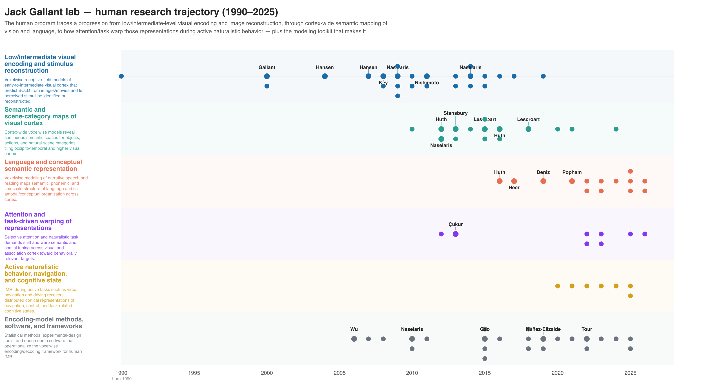
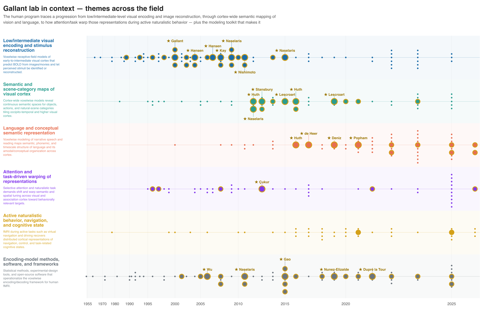

# Topic mode vs lab mode

The toolkit has two front ends. They differ only in **where the corpus comes
from**; once a verified set of papers exists, both run the identical
verify → canonicalize → count → cross-reference → families → figure → review
backbone.

| | **Topic mode** | **Lab mode** |
|---|---|---|
| **Start from** | a question | a lab's publication corpus |
| **Direction** | search *outward* from the topic | derive themes *inward*, then place them in the field |
| **Front-end phases** | 1 scope → 2 search → 2b antecedents | L1 ingest → L2 prune → L3 derive themes |
| **Shared backbone** | 3 verify → 3f canon → 5/5b → 6 xref → 6b families → 7 review → 8 | *(identical)* |
| **The question it answers** | "What's known about X?" | "What has this lab done, and where does it sit in the field?" |

---

## Topic mode

The default. You give a question and a span; the agent searches outward, runs the
required antecedents pass for the roots, and the backbone takes over. This is the
flow described throughout [The pipeline](pipeline.md) and
[Phases in detail](phases.md).

> *"I want a literature review on the anatomical connections between the visual
> system and the cerebellum — any anatomy papers, primate or human, any
> tractography method, back to the 1970s."*

---

## Lab mode

Lab mode **inverts the front end**: instead of starting from a query, it starts
from a known body of work — a lab's output — derives the lab's research themes
and how they shifted over time, and only *then* searches outward to place that
work in the surrounding field.

### L1 — Ingest the corpus

```bash
python3 ../tools/lab_corpus.py --search "Jack Gallant"          # find the OpenAlex id
python3 ../tools/lab_corpus.py --author A5056348548 --out lab_papers.json
```

[`tools/lab_corpus.py`](https://github.com/gallantlab/literature-review-toolkit/blob/main/tools/lab_corpus.py)
pulls a PI's authored works from OpenAlex (pass several `--author` ids for
PI + key members to widen coverage). Each row carries title / year / DOI / APA /
venue / citation count / topics / abstract / coauthors / type.

### L2 — Prune false positives *(human decision)*

Author disambiguation is the **#1 correctness risk** in lab mode — OpenAlex will
fold in same-name authors. You review the ingested list and drop the
false-positives before anything is themed.

### L3 — Derive themes and their drift

The agent derives the lab's research themes from the (abstract-enriched) corpus
and tracks how emphasis moved over time. OpenAlex's light topic metadata alone is
**not** enough — abstracts are enriched first. The themes become the lanes the
rest of the pipeline uses.

!!! note "Lab mode antecedents include the lab's own pre-paradigm work"
    The antecedents pass (still required) must surface the lab's **own**
    foundational work — e.g. macaque physiology that predates the lab's current
    human-imaging paradigm. An inclusion filter like "human fMRI only" must not
    silently drop those papers; they're re-entered as lab-sourced (and starred).

### Then: the shared backbone

From verification onward, lab mode is identical to topic mode — every reference
verified and canonicalized, counts fetched, cross-citations mined, and optionally
a families figure and review article. The figure and review are *contextualized*:
they show the lab's work **against** the field it sits in.

<div class="gallery" markdown>

<figure class="fig" markdown>
{ loading=lazy }
<figcaption>L3 output — a lab's research themes and how their emphasis shifted across decades.</figcaption>
</figure>

<figure class="fig" markdown>
{ loading=lazy }
<figcaption>The contextualized lineage figure — the lab's papers (highlighted) placed within the surrounding literature.</figcaption>
</figure>

</div>

See the [`gallant_lab` worked example](examples.md#lab-mode-the-gallant-lab-in-context)
for the full run.
