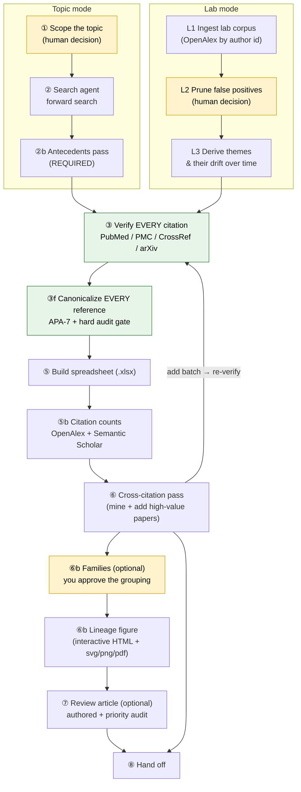

# The pipeline

The whole flow on one page. Two front ends — **topic mode** and **lab mode** —
converge on a shared verify → canonicalize → count → cross-reference → (group →
figure → write) backbone.

<small>Yellow = a human decision. Green = a guarded, ground-truth step that runs
automatically but fails the build if something is wrong.</small>

## The three human decisions

Everything else is mechanized. You only *decide* three things (the last two are
optional):

| # | You decide… | Phase | Why it's yours |
|---|---|---|---|
| 1 | **Scope** — topic and span (or which lab corpus) | 1 / L1–L2 | Only you know the question. |
| 2 | **Families** *(optional)* | 6b | You approve the grouping *before* it labels every paper. |
| 3 | **The write-up** *(optional)* | 7 | Prose is judgment; the toolkit won't fake it. |

## The guardrails between them

These run without your attention — but each has a ground truth, so each is
checked automatically:

!!! abstract "Antecedents (Phase 2b, required)"
    The forward search is recency-biased and anchored on the topic's *current*
    framing, so it misses the roots. A separate pass searches three axes —
    measurement/method origins, foundational empirical results, and
    theory/computational framework — and folds them into the existing themes.

!!! danger "Verification (Phase 3, critical)"
    Search agents fabricate roughly **1 in 4** citations: wrong first authors,
    inverted findings, invented or mis-copied DOIs, and occasionally an *entirely
    wrong author list for a real paper*. Every citation — agent-sourced **and**
    tool-sourced — is checked against PubMed/PMC/CrossRef and the arXiv API
    before anything downstream trusts it.

!!! success "Canonicalization (Phase 3f, hard gate)"
    Every reference is rebuilt from its verified DOI/arXiv id into canonical
    APA-7 — full author lists, particles, casing, real venue names (incl.
    bioRxiv/PsyArXiv), HTML-unescaping. The journal DOI is preferred over an
    arXiv preprint as the version of record. `--audit` **exits non-zero on any
    imperfect reference**, so a broken ref fails the build, not your reader.

!!! info "Counts, cross-citation, dedup"
    Citation counts are fetched from OpenAlex, reconciled against Semantic
    Scholar, and schema-checked. The cross-citation pass mines the corpus's own
    reference lists to surface frequently-cited papers you missed. Reference ids
    stay globally unique across merges; counts are attached only after ids are
    final.

## Phases at a glance

**1** scope · **2** search · **2b** antecedents *(required)* · **3** verify
*(critical)* · **3f** canonicalize · **4** PDFs *(opt-in)* · **5** spreadsheet ·
**5b** citation counts · **6** cross-citation · **6b** families *(opt)* · **7**
review article *(opt)* · **8** hand-off.

**Lab mode** swaps phases 1–2 for *ingest-corpus → prune → derive-themes*, then
converges on this same pipeline from Phase 3 onward.

→ Continue to **[Phases in detail](phases.md)** for each phase's command,
guardrail, and real output.
